# Implementation Plan: Swipies Ads Financial Security, Tenant Isolation & Admin Password Hardening

**Plan Key:** `plan_ads_financial_security_and_admin_fixes`  
**Specification:** [`spec_ads_financial_security_and_admin_fixes.md`](file:///D:/ragflow/swipies_25/ragflow/docs/specs/spec_ads_financial_security_and_admin_fixes.md)  
**Status:** In Execution  

---

## 1. Phased Architecture & Execution Order

```mermaid
graph TD
    subgraph Phase1 [Phase 1: Financial Backdoors & Arbitrage]
        P1_1["1.1 Delete POST /v1/ads/billing/deposit in ad_app.py"]
        P1_2["1.2 Enforce Server-Side FX Computation in payment_service.py"]
    end

    subgraph Phase2 [Phase 2: Authorization & IDOR Multi-Tenancy]
        P2_1["2.1 Enforce require_superuser on /v1/ads/admin/process-renewals"]
        P2_2["2.2 Enforce adv.id scope on Campaign Insights in ad_app.py"]
        P2_3["2.3 Enforce adv.id scope on Audience Members in ad_app.py"]
        P2_4["2.4 Enforce adv.id scope on Feeds Management in ad_app.py"]
    end

    subgraph Phase3 [Phase 3: Database & Privacy Cleanups]
        P3_1["3.1 Delete runtime ALTER TABLE in ad_engine_service.py"]
        P3_2["3.2 Replace hardcoded developer email in db_models.py & auth.py"]
        P3_3["3.3 Atomic balance mutation with for_update() in ad_engine_service.py"]
    end

    subgraph Phase4 [Phase 4: Admin Password Bugfix]
        P4_1["4.1 Fix ChangePasswordForm & users.tsx: Direct submit + suppress autofill"]
        P4_2["4.2 Add encodeURIComponent(username) in admin-service.ts / api.ts"]
        P4_3["4.3 Add case-insensitive & whitespace-stripped lookup in services.py & auth.py"]
        P4_4["4.4 Add success/error toast notifications in users.tsx"]
    end

    subgraph Phase5 [Phase 5: Automated Verification & Deployment]
        P5_1["5.1 Run test_ads_security.py & test_admin_user_password.py"]
        P5_2["5.2 Frontend Build & TypeScript Check"]
        P5_3["5.3 Git commit, push, & container deployment to live host"]
    end

    Phase1 --> Phase2
    Phase2 --> Phase3
    Phase3 --> Phase4
    Phase4 --> Phase5
```

---

## 2. Detailed Task Breakdown

### Phase 1: Financial Backdoors & Arbitrage
- [ ] **Task 1.1 (AC1 / SEC-01):** Remove `POST /v1/ads/billing/deposit` route and function in `api/apps/ad_app.py`. Ensure requests return 404.
- [ ] **Task 1.2 (AC2 / SEC-02):** In `api/db/services/payment_service.py` (`create_payment_order`), sanitize client input: if `amount_uzs > 0`, calculate `final_usd = round(float(amount_uzs) / rate, 2)` ignoring any client-sent `amount_usd`.

### Phase 2: Authorization & IDOR Multi-Tenancy
- [ ] **Task 2.1 (AC3 / SEC-03):** In `api/apps/ad_app.py` (`admin_process_subscription_renewals`), verify superuser with `auth_err = require_superuser()` and return 403 on failure.
- [ ] **Task 2.2 (AC4 / SEC-04):** In `api/apps/ad_app.py` (`get_campaign_insights`), enforce `AdCampaign.advertiser_id == adv.id`.
- [ ] **Task 2.3 (AC4 / SEC-05):** In `api/apps/ad_app.py` (`add_audience_member`), verify segment ownership `AdAudienceSegment.advertiser_id == adv.id`.
- [ ] **Task 2.4 (AC4 / SEC-06):** In `api/apps/ad_app.py` (`feed_items_management`), verify feed ownership `AdFeed.advertiser_id == adv.id`.

### Phase 3: Database & Privacy Cleanups
- [ ] **Task 3.1 (AC5 / ARCH-03):** In `api/db/services/ad_engine_service.py` (`get_or_create_pixel_id`), remove dynamic `ALTER TABLE` DDL queries.
- [ ] **Task 3.2 (AC6 / SEC-07):** In `api/db/db_models.py` (line 3645) and `admin/server/auth.py` (line 339), remove hardcoded `albakiev.sardorbek@gmail.com` and use `os.environ.get("DEFAULT_SUPERUSER_EMAIL", "admin@ragflow.io")` with parameterized query.
- [ ] **Task 3.3 (AC7/AC8 / BUG-08/09):** In `api/db/services/ad_engine_service.py`, wrap balance updates (`deposit_balance`, impressions, clicks) in `with DB.atomic():` with `for_update()`.

### Phase 4: Admin Password Bugfix
- [ ] **Task 4.1 (AC9 / BUG-10):** In `web/src/pages/admin/forms/change-password-form.tsx` and `web/src/pages/admin/users.tsx`:
  - Connect submit button directly to form submit execution.
  - Set `autoComplete="new-password"` and `data-lpignore="true"` on password fields to block browser autofill.
  - Reset form on modal open (`form.reset({ newPassword: '', confirmPassword: '' })`).
- [ ] **Task 4.2 (AC9 / BUG-10):** In `web/src/utils/api.ts`, add `encodeURIComponent(username)` to `adminUpdateUserPassword`.
- [ ] **Task 4.3 (AC9 / BUG-10):** In `admin/server/services.py:222` (`update_user_password`), normalize username with `.strip()` and support case-insensitive fallback (`fn.LOWER(cls.model.email) == username.strip().lower()`).
- [ ] **Task 4.4 (AC9 / BUG-10):** In `web/src/pages/admin/users.tsx`, add `message.success` and `message.error` toast feedback on password mutation.

### Phase 5: Automated Verification & Deployment
- [ ] **Task 5.1:** Write and run automated tests in `test/testcases/test_ads_security.py` and `test/unit_test/admin/test_admin_user_password.py`.
- [ ] **Task 5.2:** Build frontend (`npm run build`) to ensure zero errors.
- [ ] **Task 5.3:** Commit changes, push to `test` branch, and deploy to live server.
