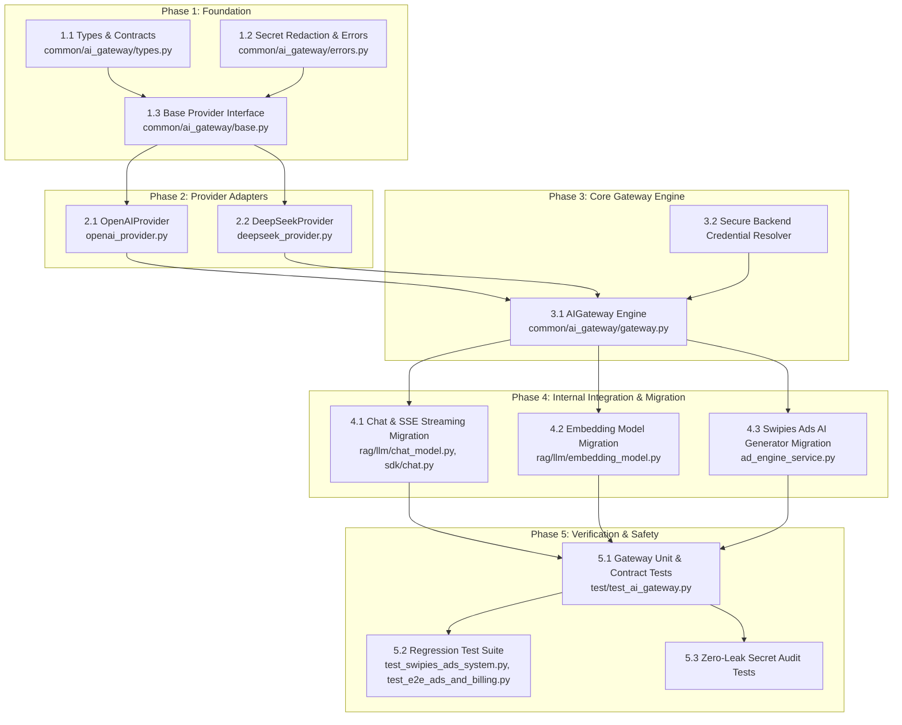

# Technical Implementation Plan: AI Gateway (Centralized AI Core)

**Specification Reference:** [`docs/specs/spec_ai_gateway.md`](file:///D:/ragflow/swipies_25/ragflow/docs/specs/spec_ai_gateway.md)  
**Status:** Draft / Ready for Review  
**Version:** 1.0.0  
**Target Branch:** `test`  

---

## 1. Architecture & Dependency Graph



---

## 2. Implementation Phases & Vertical Slices

### Phase 1: Core Foundation & Interface Contracts
**Objective:** Establish pure data models, abstract classes, and zero-leakage security utilities without touching external dependencies.

- **Task 1.1: Data Types & Schemas (`common/ai_gateway/types.py`)**
  - Define `ProviderType`, `ModelCapability`, `TokenUsage`.
  - Define `GatewayMessage`, `GatewayChatRequest`, `GatewayChatResponse`.
  - Define `GatewayStreamChunk` (with `delta_content`, `delta_reasoning`, `tool_calls_chunk`, `usage`).
  - Define `GatewayEmbeddingRequest`, `GatewayEmbeddingResponse`.
- **Task 1.2: Error Handling & Secret Redactor (`common/ai_gateway/errors.py`)**
  - Implement `AIGatewayError`, `ProviderAuthError`, `RateLimitError`, `QuotaExceededError`.
  - Implement `SecretRedactor` with regex rules targeting `sk-[a-zA-Z0-9_\-]{20,}`, `Bearer\s+[^\s]+`, and URL key params.
- **Task 1.3: Abstract Provider Base (`common/ai_gateway/base.py`)**
  - Implement `AIProvider(ABC)` with abstract methods: `chat_complete`, `chat_stream`, `embed`, `count_tokens`.
  - Include protected helper `_redact_error_context(exc)`.

---

### Phase 2: Concrete Provider Adapters
**Objective:** Implement vendor-specific communication behind the `AIProvider` interface.

- **Task 2.1: OpenAI Adapter (`common/ai_gateway/providers/openai_provider.py`)**
  - Implement `OpenAIProvider(AIProvider)` using `openai.AsyncOpenAI`.
  - Map `GatewayChatRequest` to OpenAI Chat Completion payload (`model`, `messages`, `temperature`, `top_p`, `tools`, `response_format`).
  - Handle streaming via `AsyncIterator[GatewayStreamChunk]`.
  - Support `text-embedding-3-small`, `text-embedding-3-large`, `text-embedding-ada-002`.
  - Extract exact `usage` from final stream chunk or standard response.
- **Task 2.2: DeepSeek Adapter (`common/ai_gateway/providers/deepseek_provider.py`)**
  - Implement `DeepSeekProvider(AIProvider)` pointing to `https://api.deepseek.com/v1`.
  - Handle `deepseek-reasoner` thought stream extraction (`delta.reasoning_content` -> `GatewayStreamChunk.delta_reasoning`).
  - Implement token calculation matching DeepSeek specs.

---

### Phase 3: Central AI Gateway Engine
**Objective:** Orchestrate provider resolution, backend credential injection, and error protection.

- **Task 3.1: Gateway Registry & Dispatcher (`common/ai_gateway/gateway.py`)**
  - Implement `AIGateway` singleton with dynamic provider registration (`register_provider`).
  - Implement `get_provider(provider_type, tenant_id)`.
  - Implement `chat(request, tenant_id)`, `stream_chat(request, tenant_id)`, `embeddings(request, tenant_id)`.
- **Task 3.2: Secure Backend Credential Resolver (`common/ai_gateway/credential_resolver.py`)**
  - Resolve API keys from system environment (`OPENAI_API_KEY`, `DEEPSEEK_API_KEY`) or database (`TenantLLM`).
  - Enforce zero-leak rule: credentials never returned to caller, never logged, and instantiated exclusively in backend memory.

---

### Phase 4: Call-Site Migration (Zero-Bypass Integration)
**Objective:** Route all existing platform AI invocations through `AIGateway`.

- **Task 4.1: Chat & SSE Streaming Migration**
  - Refactor `rag/llm/chat_model.py` and `api/apps/sdk/chat.py` to invoke `AIGateway().stream_chat()`.
  - Ensure reasoning tokens (`<think>...</think>`) and standard SSE formatting remain 100% compatible.
- **Task 4.2: Embedding Services Migration**
  - Refactor `rag/llm/embedding_model.py` and `rag/nlp/search.py` to route embedding requests through `AIGateway().embeddings()`.
- **Task 4.3: Swipies Ads AI Generator Migration**
  - Refactor `AdEngineService.generate_copy` and `generate_ad_creative` in `api/db/services/ad_engine_service.py` to call `AIGateway().chat()`.

---

### Phase 5: Verification, Security Audit & Regression Testing
**Objective:** Prove reliability, secret isolation, and full backward compatibility.

- **Task 5.1: AI Gateway Unit Test Suite (`test/test_ai_gateway.py`)**
  - Mock OpenAI / DeepSeek HTTP API endpoints.
  - Verify sync completions, streaming chunks, reasoning chunks, and embeddings.
- **Task 5.2: Secret Redaction & Leakage Audit Tests**
  - Trigger artificial 401/429/500 errors containing mock keys `sk-proj-test1234567890abcdef`.
  - Assert that logs, exception strings, and API payloads contain only `[REDACTED_API_KEY]`.
- **Task 5.3: Platform-Wide Regression Suite**
  - Run `test/test_swipies_ads_system.py` and `test/test_e2e_ads_and_billing.py` (all 33 existing tests must pass).
  - Verify frontend `npm run build` passes with zero TypeScript or bundling errors.

---

## 3. Risks & Mitigation Matrix

| Risk | Likelihood | Impact | Mitigation Strategy |
|---|---|---|---|
| **Streaming Latency Overhead** | Low | Medium | Stream chunks are yielded immediately via pure Python asynchronous iterators (`async for`) with zero intermediate buffering or blocking I/O. |
| **DeepSeek `<think>` Tag Breakage** | Medium | Medium | Standardize `delta_reasoning` in `GatewayStreamChunk` and wrap in `<think>...</think>` tags only when the downstream client protocol expects it. |
| **Accidental API Key Leakage in Logs** | Medium | High | Implement mandatory `SecretRedactor` interceptor on all gateway logging calls and exception handlers before any text reaches stdout or log files. |
| **Regression in Existing Tests** | Low | High | Maintain complete backward compatibility in `rag/llm/chat_model.py` and run full 33-test suite at each phase checkpoint. |

---

## 4. Verification Checkpoints & Commands

```powershell
# 1. Run AI Gateway Unit Tests
python -m unittest test/test_ai_gateway.py

# 2. Run Full Platform Regression Tests (Ads, Billing, RBAC)
python -m unittest test/test_swipies_ads_system.py test/test_e2e_ads_and_billing.py

# 3. Verify Frontend Build Integrity
cd D:\ragflow\swipies_25\ragflow\web ; npm run build

# 4. Verify Git Status & Clean Tree
git status
```

---

## 5. Definition of Done (DoD)

- [ ] `common/ai_gateway/` module created with clean modular structure.
- [ ] `OpenAIProvider` and `DeepSeekProvider` fully implemented and tested.
- [ ] Chat, Streaming, Embeddings, and Swipies Ads AI generators routed through `AIGateway`.
- [ ] Zero plain-text API keys present in logs, error payloads, or frontend HTTP responses.
- [ ] All 33 unit tests + new AI Gateway tests passing with `OK`.
- [ ] Frontend `npm run build` succeeds cleanly.
- [ ] Committed and pushed to remote branch `swipies_ai/test`.
