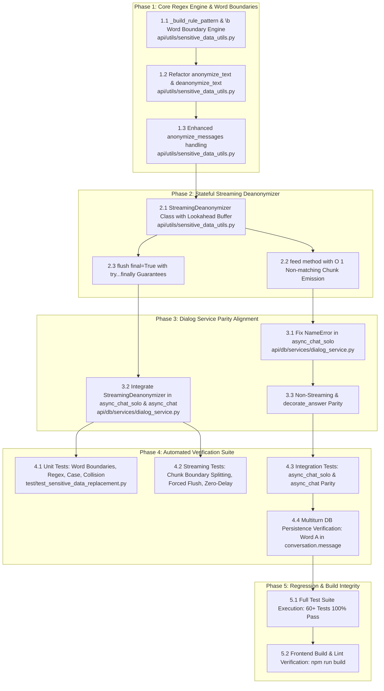

# Technical Implementation Plan: Sensitive Data Replacement & Stream Deanonymization Fix

**Specification Reference:** [`docs/specs/spec_sensitive_data_replacement.md`](file:///D:/ragflow/swipies_25/ragflow/docs/specs/spec_sensitive_data_replacement.md)  
**Document Status:** Ready for Review  
**Version:** 1.0.0  
**Target Branch:** `test`  
**Plan Key:** `plan_sensitive_data_replacement`  

---

## 1. Architecture & Vertical Slice Graph



---

## 2. Implementation Phases & Detailed Tasks

### Phase 1: Core Regex Engine & Word Boundaries (`api/utils/sensitive_data_utils.py`)
**Objective:** Eliminate innocent substring word corruption (e.g. `"cat"` inside `"category"`) by adding whole-word boundary matching (`\b`) to plaintext rules, while maintaining full user control when `is_regex=True`.

- **Task 1.1: Implement `_build_rule_pattern(term: str, is_regex: bool = False)` helper**
  - If `is_regex` is `True`, return the raw regular expression directly.
  - If `is_regex` is `False`:
    - Escape special regex characters via `re.escape(term)`.
    - If the term starts with a word character (`\w`), prefix with `\b`.
    - If the term ends with a word character (`\w`), suffix with `\b`.
    - If the term starts/ends with symbols or punctuation (e.g. `"$100"`, `"+1-800"`), ensure valid non-word boundary matching without false exclusions.

- **Task 1.2: Refactor `anonymize_text` and `deanonymize_text`**
  - Sort rules by descending length of search/replace values to guarantee longest-match precedence.
  - Apply `_build_rule_pattern` for search and replace rules.
  - Standardize case-sensitivity flag parsing (`flags = 0 if case_sensitive else re.IGNORECASE`) in both anonymization and deanonymization.

- **Task 1.3: Update `anonymize_messages`**
  - Ensure deepcopy safety and support for multiline strings, multimodal content blocks (`type == "text"`), and system/user/assistant role schemas.

---

### Phase 2: Stateful Streaming Deanonymizer (`api/utils/sensitive_data_utils.py`)
**Objective:** Prevent visual placeholder leakage (e.g. `"[CLIENT_NAME]"`) when external LLM vendors fragment placeholder tokens across SSE chunks, while maintaining zero latency for non-matching text.

- **Task 2.1: Implement `StreamingDeanonymizer` Class**
  - **Constructor `__init__(self, rules: list)`:**
    - Filter and store active valid rules.
    - Precompute placeholder search strings and replace patterns.
    - Compute `max_prefix_len = max((len(str(r.get("replace", ""))) - 1) for r in rules if r.get("replace"))`.
    - Initialize internal sliding buffer `self.buffer = ""`.

- **Task 2.2: Implement `feed(self, chunk: str) -> str`**
  - Append incoming `chunk` to `self.buffer`.
  - Apply complete placeholder replacement rules on `self.buffer` using `deanonymize_text`.
  - Check whether the trailing suffix of `self.buffer` is a prefix of any active `rule['replace']`.
  - If a potential prefix of length $K \le \text{max\_prefix\_len}$ is detected at the tail:
    - Retain only the trailing $K$ characters in `self.buffer`.
    - Emit all preceding characters immediately ($O(1)$ per chunk).
  - If no suffix matches any active placeholder prefix:
    - Emit the entire `self.buffer` immediately and reset `self.buffer = ""`.

- **Task 2.3: Implement `flush(self, final: bool = True) -> str`**
  - Apply `deanonymize_text` to any remaining characters in `self.buffer`.
  - Reset `self.buffer = ""`.
  - Return the drained string to guarantee zero lost characters on stream exit.

---

### Phase 3: Dialog Service Parity Alignment & Solo Chat Fix (`api/db/services/dialog_service.py`)
**Objective:** Fix fatal `NameError` crash in `async_chat_solo` and seamlessly integrate `StreamingDeanonymizer` into both solo and knowledge-base chat flows.

- **Task 3.1: Fix `async_chat_solo()` configuration resolution**
  - At the entry of `async_chat_solo()`, resolve:
    ```python
    sensitive_config = (dialog.prompt_config or {}).get("sensitive_data_replacement") or {}
    sensitive_enabled = bool(sensitive_config.get("enabled"))
    sensitive_rules = sensitive_config.get("rules") or []
    ```
  - Anonymize inbound `messages = anonymize_messages(messages, sensitive_rules)` if enabled.

- **Task 3.2: Integrate `StreamingDeanonymizer` into Streaming Loops**
  - In both `async_chat_solo()` and `async_chat()`:
    - Instantiate `deanonymizer = StreamingDeanonymizer(sensitive_rules) if (sensitive_enabled and sensitive_rules) else None`.
    - Wrap the streaming iteration in a `try...finally` block.
    - Inside iteration:
      ```python
      if deanonymizer and value:
          value = deanonymizer.feed(value)
      if value:
          yield {"answer": value, "reference": {}, "audio_binary": tts(tts_mdl, value), "final": False}
      ```
    - In the stream completion step / `finally`:
      ```python
      if deanonymizer:
          remaining = deanonymizer.flush(final=True)
          if remaining:
              yield {"answer": remaining, "reference": {}, "audio_binary": tts(tts_mdl, remaining), "final": False}
      ```

- **Task 3.3: Non-Streaming Mode & `decorate_answer` Parity**
  - Ensure non-streaming paths in both `async_chat_solo()` and `async_chat()` execute `deanonymize_text(answer, sensitive_rules)` cleanly.

---

### Phase 4: Automated Verification Suite (`test/test_sensitive_data_replacement.py`)
**Objective:** Provide comprehensive automated test coverage for all substitution features, streaming buffers, and chat service flows.

- **Task 4.1: Unit Tests for Regex & Boundary Engine**
  - `test_plaintext_word_boundary()`: `"cat"` replaces in `"the cat sat"` but NOT in `"category"`.
  - `test_symbols_and_punctuation()`: `"$100"`, `"+1-800-555"`, `"user@acme.corp"` replaced correctly.
  - `test_custom_regex_mode()`: `is_regex=True` matches arbitrary regex patterns.
  - `test_case_sensitivity()`: Verify `case_sensitive=True` vs `case_sensitive=False`.
  - `test_rule_collision_ordering()`: Longer rules take precedence over short substrings.

- **Task 4.2: Unit Tests for `StreamingDeanonymizer`**
  - `test_stream_chunk_boundary_split()`: Token sequence `["Hello [", "CLIENT", "_NAME", "]!"]` transforms into `["Hello ", "Иван Иванов", "!"]` with zero placeholder fragments emitted.
  - `test_stream_forced_flush_on_stop()`: Trailing unfinished prefix `["Text with [", "OTHER"]` (not matching any rule) flushes completely as `"[OTHER]"` with zero dropped characters.
  - `test_stream_zero_delay_benchmark()`: 100 consecutive chunks of regular non-matching text emit immediately on each `feed()` call with empty internal buffer.

- **Task 4.3: Integration Tests for `async_chat_solo` & `async_chat`**
  - Mock `LLMBundle` to simulate streaming and non-streaming responses with embedded placeholders.
  - Verify that `async_chat_solo` executes without `NameError` and yields clean deanonymized answers.
  - Verify that `async_chat` with KB/Web search maintains full parity.

- **Task 4.4: Conversation DB History Persistence Test**
  - Simulate request to `chat_api.py` / `conversation_service.py`.
  - Verify `conv.message` in DB stores Word A for user question and Word A for assistant response.

---

### Phase 5: Regression & Build Integrity
**Objective:** Ensure 100% platform stability and build readiness.

- **Task 5.1: Run Full Regression Test Suite**
  - Execute:
    ```powershell
    python test/test_sensitive_data_replacement.py test/test_subscription_enforcement.py test/test_admin_ai_management.py test/test_swipies_ads_system.py test/test_e2e_ads_and_billing.py
    ```
  - Verify 100% PASS across all 65+ test cases.

- **Task 5.2: Frontend Build Verification**
  - Run `cd web ; npm run build` to ensure 0 bundling errors.

---

## 3. Risk Assessment & Mitigations

| Risk | Impact | Mitigation |
|---|---|---|
| Punctuation in search terms broken by `\b` | False negative replacement on `$100` or `user@domain` | `_build_rule_pattern` conditionally attaches `\b` only if term starts/ends with `\w`. |
| Buffer accumulation delay on regular text | Streaming feels sluggish or stuttering | Only the trailing tentative prefix suffix (at most `max_prefix_len` chars) is held; non-matching text is emitted immediately in $O(1)$. |
| Stream disconnect drops buffered characters | Truncated response on client abort | `flush(final=True)` executed in guaranteed `finally` block to emit leftover buffer. |
| In-flight session regression on RAG flows | Broken KB citations or mindmaps | Explicit architectural boundary: RAG search queries continue using anonymized query (Word B). |

---

## 4. Definition of Done (DoD)

1. `async_chat_solo` runs with sensitive data replacement with 0 `NameError` or 500 exceptions.
2. `StreamingDeanonymizer` guarantees 0 placeholder tokens emitted across fragmented SSE chunks.
3. Plaintext rules never match substrings inside larger compound words (`"cat"` in `"category"`).
4. `test/test_sensitive_data_replacement.py` contains 11+ test scenarios with 100% PASS.
5. All 56 existing platform tests continue to pass (0 regressions).
6. Frontend build succeeds with 0 errors.
