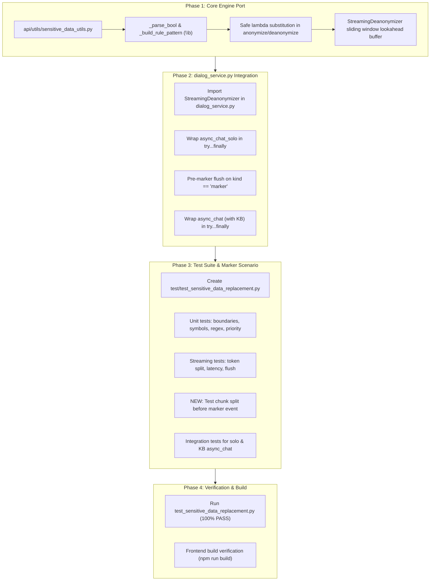

# Technical Implementation Plan: Sensitive Data Replacement Port to `licence_v`

**Plan Key:** `plan_sensitive_data_replacement_licence_v`  
**Target Branch:** `licence_v`  
**Specification Reference:** [`spec_sensitive_data_replacement_licence_v.md`](file:///D:/ragflow/swipies_25/ragflow/docs/specs/spec_sensitive_data_replacement_licence_v.md)  
**Document Status:** Ready for Review  
**Version:** 1.0.0  
**Author:** AI Architecture Team / Antigravity Assistant  
**Date:** 2026-08-27  

---

## 1. Architecture Overview & Phased Roadmap



---

## 2. Detailed Phase Breakdown

### Phase 1: Core Engine Port in `api/utils/sensitive_data_utils.py`
- **File Target:** [`api/utils/sensitive_data_utils.py`](file:///D:/ragflow/swipies_25/ragflow/api/utils/sensitive_data_utils.py)
- **Changes:**
  1. Add `_parse_bool(val: Any) -> bool` helper for uniform truthiness checking.
  2. Implement `_build_rule_pattern(term: str, is_regex: bool = False) -> str`:
     - If `is_regex` is `True`, return `term` directly.
     - Escape `term` with `re.escape`.
     - Prepend `\b` if `re.match(r"^\w", term)` matches.
     - Append `\b` if `re.search(r"\w$", term)` matches.
  3. Refactor `anonymize_text` and `deanonymize_text`:
     - Sort rules by descending length of `search` or `replace` value to prevent substring collisions.
     - Use `lambda _m, rv=replace_val: rv` to avoid Python regex backslash escape pitfalls (e.g. `\1`, `\U`, `\t`).
     - Support `case_sensitive` toggle in both functions.
  4. Implement `StreamingDeanonymizer` class:
     - `__init__(rules: list)`: filter active rules, sort descending by `len(replace)`, compute `max_prefix_len = max(len(replace) - 1, 0)`.
     - `feed(chunk: str) -> str`:
       - Append `chunk` to internal `_buffer`.
       - Check for any active placeholder match; if found, substitute with original Word A.
       - Emit safe prefix characters that cannot form part of any active placeholder prefix in $O(1)$.
     - `flush(final: bool = False) -> str`:
       - If `final=True`: apply full `deanonymize_text` to remaining buffer and return all characters, clearing `_buffer = ""`.
       - If `final=False`: perform non-final flush of any complete matches or safe prefix before marker transitions.

---

### Phase 2: Integration into `_stream_with_think_delta` in `dialog_service.py`
- **File Target:** [`api/db/services/dialog_service.py`](file:///D:/ragflow/swipies_25/ragflow/api/db/services/dialog_service.py)
- **Changes:**
  1. Update imports on line 42:
     ```python
     from api.utils.sensitive_data_utils import anonymize_messages, deanonymize_text, StreamingDeanonymizer
     ```
  2. In `async_chat_solo`:
     - Initialize `stream_deanonymizer = StreamingDeanonymizer(sensitive_rules) if (sensitive_enabled and sensitive_rules) else None`.
     - Wrap the streaming iteration in `try...finally`:
       ```python
       try:
           async for kind, value, state in _stream_with_think_delta(stream_iter):
               last_state = state
               if kind == "marker":
                   if stream_deanonymizer:
                       flushed = stream_deanonymizer.flush(final=False)
                       if flushed:
                           yield {"answer": flushed, "reference": {}, "audio_binary": tts(tts_mdl, flushed) if tts_mdl else None, "prompt": "", "created_at": time.time(), "final": False}
                   flags = {"start_to_think": True} if value == "<think>" else {"end_to_think": True}
                   yield {"answer": "", "reference": {}, "audio_binary": None, "prompt": "", "created_at": time.time(), "final": False, **flags}
                   continue

               if stream_deanonymizer and value:
                   value = stream_deanonymizer.feed(value)

               if value:
                   yield {"answer": value, "reference": {}, "audio_binary": tts(tts_mdl, value) if tts_mdl else None, "prompt": "", "created_at": time.time(), "final": False}
       finally:
           if stream_deanonymizer:
               tail = stream_deanonymizer.flush(final=True)
               if tail:
                   yield {"answer": tail, "reference": {}, "audio_binary": tts(tts_mdl, tail) if tts_mdl else None, "prompt": "", "created_at": time.time(), "final": False}
       ```
  3. In `async_chat` (with KB):
     - Apply the exact same `try...finally` pattern with `stream_deanonymizer` around line 939.

---

### Phase 3: Automated Test Suite & Think Marker Boundary Scenario
- **File Target:** [`test/test_sensitive_data_replacement.py`](file:///D:/ragflow/swipies_25/ragflow/test/test_sensitive_data_replacement.py)
- **Changes:**
  - Adapt test cases for `licence_v` return types (dictionaries).
  - Implement **NEW scenario**: `test_09_streaming_think_marker_boundary_flush`
    - Simulate an LLM stream emitting `["Thinking about [", "CLIENT", "_NAME", "]"]`, then `("marker", "</think>")`, then answer text.
    - Verify that `feed()` and pre-marker `flush(final=False)` deanonymize `[CLIENT_NAME]` cleanly before `</think>` is yielded, with zero cross-section buffer contamination.

---

### Phase 4: Full Verification & Production Build
- Execute full test suite:
  ```powershell
  python test/test_sensitive_data_replacement.py
  ```
- Run frontend build:
  ```powershell
  cd web ; npm run build
  ```

---

## 3. Risk Assessment & Mitigations

| Potential Risk | Severity | Mitigation Strategy |
| :--- | :---: | :--- |
| **Stream Disconnect Token Loss** | High | `try...finally` block unconditionally executes `flush(final=True)`, guaranteeing 100% token emission. |
| **Marker Event Contamination** | Medium | `kind == "marker"` calls non-final `flush(final=False)` before yielding marker dictionary. |
| **Zero-Overhead for Disabled Rules** | Low | If `sensitive_enabled` is False, `stream_deanonymizer` remains `None`, bypassing buffer logic entirely. |
| **Think/Answer Parsing Regression** | Low | `_stream_with_think_delta()` remains untouched; its token batching continues undisturbed. |
