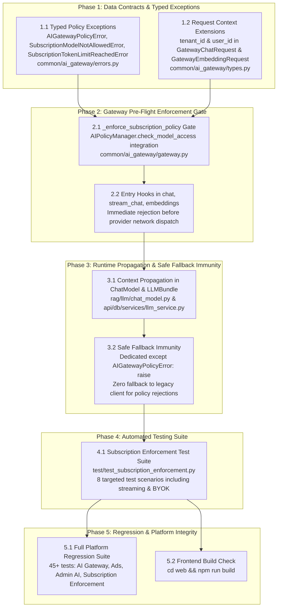

# Technical Implementation Plan: Subscription Policy & Token Limit Enforcement in AI Gateway

**Specification Reference:** [`docs/specs/spec_subscription_enforcement.md`](file:///D:/ragflow/swipies_25/ragflow/docs/specs/spec_subscription_enforcement.md)  
**Status:** Draft / Ready for Review  
**Version:** 1.0.0  
**Target Branch:** `test`  
**Plan Key:** `plan_subscription_enforcement`  

---

## 1. Architecture & Dependency Graph



---

## 2. Implementation Phases & Vertical Slices

### Phase 1: Data Contracts & Typed Policy Exceptions
**Objective:** Define the strict error hierarchy and ensure `GatewayChatRequest` carries tenant and user context.

- **Task 1.1: Implement Typed Policy Exceptions in [`common/ai_gateway/errors.py`](file:///D:/ragflow/swipies_25/ragflow/common/ai_gateway/errors.py)**
  - Define `AIGatewayPolicyError(AIGatewayError)` with `status_code: int = 403`.
  - Define `SubscriptionModelNotAllowedError(AIGatewayPolicyError)` with `status_code: int = 403`.
  - Define `SubscriptionTokenLimitReachedError(AIGatewayPolicyError)` with `status_code: int = 429`.

- **Task 1.2: Extend Gateway DTOs in [`common/ai_gateway/types.py`](file:///D:/ragflow/swipies_25/ragflow/common/ai_gateway/types.py)**
  - Add optional fields `tenant_id: Optional[str] = None` and `user_id: Optional[str] = None` to `GatewayChatRequest` and `GatewayEmbeddingRequest`.

---

### Phase 2: Gateway Pre-Flight Enforcement Gate (`common/ai_gateway/gateway.py`)
**Objective:** Establish the mandatory pre-flight gate inside `AIGateway` before any outbound vendor connection is made.

- **Task 2.1: Implement `_enforce_subscription_policy`**
  - Connect to `AIPolicyManager.check_model_access(tenant_id, model_name, model_type, user_id)`.
  - Bypass policy checks if `tenant_id is None` or `tenant_id == "system"`.
  - On policy failure (`allowed == False`), raise `SubscriptionTokenLimitReachedError` (if status_code 429) or `SubscriptionModelNotAllowedError` (if status_code 403).

- **Task 2.2: Hook Pre-Flight Gate in Entry Methods**
  - Call `self._enforce_subscription_policy` in `AIGateway.chat()` before calling `provider.chat_complete()`.
  - Call `self._enforce_subscription_policy` in `AIGateway.stream_chat()` before yielding from `provider.chat_stream()`.
  - Call `self._enforce_subscription_policy` in `AIGateway.embeddings()` before calling `provider.embed()`.

---

### Phase 3: Runtime Context Propagation & Safe Fallback Immunity (`rag/llm/chat_model.py`)
**Objective:** Pass tenant/user context from `ChatModel` down to `AIGateway` and ensure Safe Fallback does not bypass policy rejections.

- **Task 3.1: Pass `tenant_id` and `user_id` to `GatewayChatRequest`**
  - In `Base._async_chat_streamly` and `Base._async_chat`, extract `tenant_id` from `getattr(self, "tenant_id", None)` and pass it into `GatewayChatRequest`.

- **Task 3.2: Implement Safe Fallback Bypass Immunity**
  - In `Base._async_chat_streamly` and `Base._async_chat`:
    ```python
    except AIGatewayPolicyError:
        raise  # Re-raise policy errors immediately without falling back
    except Exception as gw_err:
        # Only infrastructure failures trigger fallback to legacy client
        logging.warning(...)
    ```

- **Task 3.3: Context Propagation in `LLMBundle`**
  - Verify that `LLMBundle` assigns `self.tenant_id` to the underlying `self.mdl` (or via kwargs) so it is always present during runtime calls.

---

### Phase 4: Automated Testing & Verification Suite (`test/test_subscription_enforcement.py`)
**Objective:** Validate all 10 acceptance criteria with comprehensive unit and integration tests.

- **Task 4.1: Test Scenario 1 — Free Plan Model Restriction (HTTP 403)**
  - Attempt chat request for a `PRO` model (e.g. `gpt-4o`) from a `FREE` tenant -> assert `SubscriptionModelNotAllowedError` is raised before provider dispatch.

- **Task 4.2: Test Scenario 2 — Free Plan Permitted Model (HTTP 200)**
  - Chat request for allowed model (`gpt-4o-mini`) from `FREE` tenant -> assert successful completion.

- **Task 4.3: Test Scenario 3 — Monthly Token Limit Exhaustion (HTTP 429)**
  - Mock monthly token usage >= `monthly_token_limit` -> assert `SubscriptionTokenLimitReachedError` is raised.

- **Task 4.4: Test Scenario 4 — Daily Token Limit Exhaustion (HTTP 429)**
  - Mock daily token usage >= `daily_token_limit` -> assert `SubscriptionTokenLimitReachedError` is raised.

- **Task 4.5: Test Scenario 5 — Streaming Request Gating**
  - Execute `stream_chat()` with blocked model/quota -> assert generator raises `AIGatewayPolicyError` before any chunks are yielded.

- **Task 4.6: Test Scenario 6 — Safe Fallback Bypass Immunity**
  - Invoke `ChatModel.async_chat` and `async_chat_streamly` with an unauthorized model -> assert that `AIGatewayPolicyError` bubbles up directly and `self.async_client` is NEVER invoked.

- **Task 4.7: Test Scenario 7 — Superuser & System Bypass**
  - Execute request with `is_superuser == True` or `tenant_id="system"` -> assert unrestricted execution regardless of quotas.

- **Task 4.8: Test Scenario 8 — BYOK Model Resolution**
  - Verify BYOK model execution: quota exemption for custom models, but plan tier check (`allow_byok == True`) enforced.

---

### Phase 5: Regression & Platform Integrity
**Objective:** Confirm that the entire platform builds cleanly and passes all regression test suites.

- **Task 5.1: Run Full Test Suite**
  - Execute `test_subscription_enforcement.py` + `test_ai_gateway.py` + `test_swipies_ads_system.py` + `test_e2e_ads_and_billing.py`.
- **Task 5.2: Frontend Production Build**
  - Run `npm run build` in `web/` to confirm zero regressions or compilation issues.

---

## 3. Risks & Mitigation Matrix

| Risk / Edge Case | Likelihood | Impact | Mitigation Strategy |
|---|---|---|---|
| **Safe Fallback Bypasses Policy Block** | High | Critical | Explicit `except AIGatewayPolicyError: raise` block placed before generic `except Exception` in `chat_model.py`. |
| **Missing `tenant_id` in Internal System Calls** | Medium | Medium | `_enforce_subscription_policy` explicitly allows calls where `tenant_id is None` or `tenant_id == "system"`. |
| **Streaming Generator Exception Handling** | Medium | High | Pre-flight policy check runs synchronously at generator creation time before the first `yield`. |
| **Performance Overhead on Chat Requests** | Low | Low | `AIPolicyManager.check_model_access` performs lightweight indexed Peewee queries; adds <2ms latency. |

---

## 4. Verification Checkpoints & Commands

```powershell
# 1. Run Subscription Enforcement Test Suite
python -m unittest test/test_subscription_enforcement.py

# 2. Run Full Platform Regression Suite
python -m unittest test/test_subscription_enforcement.py test/test_ai_gateway.py test/test_swipies_ads_system.py test/test_e2e_ads_and_billing.py

# 3. Verify Frontend Build Integrity
cd D:\ragflow\swipies_25\ragflow\web ; npm run build

# 4. Check Git Status
git status
```

---

## 5. Definition of Done (DoD)

- [ ] `common/ai_gateway/errors.py` includes `AIGatewayPolicyError`, `SubscriptionModelNotAllowedError`, `SubscriptionTokenLimitReachedError`.
- [ ] `common/ai_gateway/types.py` includes `tenant_id` and `user_id` in `GatewayChatRequest` and `GatewayEmbeddingRequest`.
- [ ] `common/ai_gateway/gateway.py` enforces `_enforce_subscription_policy` in `chat()`, `stream_chat()`, and `embeddings()`.
- [ ] `rag/llm/chat_model.py` propagates `tenant_id` and implements `except AIGatewayPolicyError: raise` in `_async_chat_streamly` and `_async_chat`.
- [ ] `test/test_subscription_enforcement.py` created with all 8 test scenarios passing cleanly.
- [ ] Platform regression tests passing (`OK`, 0 errors).
- [ ] Frontend `npm run build` succeeds cleanly.
