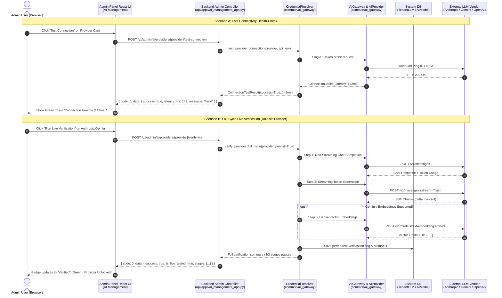

# Feature Specification: Admin Panel — AI Providers & Models Management

**Document Status:** Ready for Review  
**Version:** 1.0.0  
**Feature:** Admin Panel AI Management (`AI Management → Providers` & `AI Management → LLM Models`)  
**Author:** AI Architecture Team / Antigravity Assistant  
**Date:** 2026-08-26  
**Specification Key:** `spec_admin_ai_management`  

---

## 1. Executive Summary & Objective

### 1.1 Context & Problem Statement
With the completion of the centralized **AI Gateway** subsystem (`common/ai_gateway/`), the platform possesses a unified, decoupled architecture for routing all LLM and embedding requests through standardized `AIProvider` adapters with automated secret redacting and multi-tier credential resolution.

However, system administrators currently lack an interactive, self-service User Interface in the Admin Panel to configure, inspect, test, and manage AI providers and their respective models. Adding new credentials, enabling providers, rotating API keys, or registering models currently requires direct file editing or manual environment changes.

### 1.2 Objective
Build a modern, intuitive, and secure management interface in the Admin Panel under **"AI Management"** with two dedicated sections:
1. **`AI Management → Providers`**: Comprehensive provider lifecycle management (OpenAI, DeepSeek, Anthropic, Gemini, etc.), credential configuration with automatic masking, lightweight connectivity health-checks (`Test Connection`), and deep outbound multi-stage live verification (`Live Verification`).
2. **`AI Management → LLM Models`**: Granular registry of platform LLM (Chat) and Embedding models, allowing administrators to add, configure parameters (context window, pricing, capabilities), toggle activation status, and associate models with providers dynamically without server redeployment.

### 1.3 Scope & Boundaries

```mermaid
flowchart LR
    subgraph In Scope [✅ IN SCOPE (This Specification)]
        P1["Provider CRUD & Key Masking (via CredentialResolver)"]
        P2["Dual Testing: Fast Ping vs Full Live Verification"]
        P3["Zero-Trust UI Gating for Untested Providers (Anthropic/Gemini)"]
        P4["Model Registry CRUD: CHAT (LLM) & EMBEDDING Models only"]
        P5["Superuser Authorization via existing User.is_superuser check"]
    end

    subgraph Out of Scope [❌ OUT OF SCOPE (Future Dedicated Phases)]
        F1["Subscription Tier Model Binding (allowed models per tier)"]
        F2["Granular Token Quotas & Usage Analytics"]
        F3["End-User BYOK (Bring-Your-Own-Key) Custom Providers"]
        F4["Specialized Model Types: RERANK, VISION / IMAGE2TEXT, SPEECH2TEXT (ASR), TTS, OCR"]
    end
```

> [!IMPORTANT]
> **Strict Model Types Boundary:** In accordance with Principle I of the Platform Architecture, this phase strictly supports **`CHAT` (LLM)** and **`EMBEDDING`** model types, for which concrete adapters (`OpenAIProvider`, `DeepSeekProvider`, `AnthropicProvider`, `GeminiProvider`) are fully implemented in `common/ai_gateway/`. Specialized models (`RERANK`, `VISION`, `SPEECH2TEXT`, `TTS`, `OCR`) are deferred to separate future phases and are explicitly **OUT OF SCOPE**.

---

## 2. User Stories & Acceptance Criteria

### 2.1 User Stories
- **US-1 (Provider Configuration):** *As a system administrator, I can add or edit an AI provider (e.g. OpenAI, DeepSeek) by supplying its API key and base URL, view it in the providers table with an automatically masked key (`sk-proj...1234`), and toggle its active state instantly.*
- **US-2 (Gated Live Verification):** *As a system administrator, I see that providers without confirmed live tests (Anthropic, Gemini) are clearly badged as `"Requires Live Test"` and blocked from general routing until I run the `Live Verification` action from the UI, which validates non-streaming chat, streaming, and embeddings.*
- **US-3 (Dual Connectivity Testing):** *As a system administrator, I can run a fast `Test Connection` (1-token ping) for general health checks or a full `Live Verification` (end-to-end multi-step benchmark) to unlock a provider.*
- **US-4 (Model Management - CHAT & EMBEDDING):** *As a system administrator, I can register, edit, and toggle `CHAT` and `EMBEDDING` models associated with a configured provider, customizing context limits and parameters without touching source code.*
- **US-5 (Credential Protection):** *As a security officer, I am guaranteed that plaintext API keys are never returned to the browser in API responses, and editing an existing provider with a masked key preserves the secret securely.*

---

### 2.2 Key Acceptance Criteria (Gated Checklist)

- [ ] **AC-1 (Single Source of Truth):** All provider CRUD and key resolution operations strictly invoke the backend [`CredentialResolver`](file:///D:/ragflow/swipies_25/ragflow/common/ai_gateway/credential_resolver.py). No duplicate or parallel credential stores may be created.
- [ ] **AC-2 (Zero-Trust UI & API Gating):** Providers with `is_live_tested == False` (Anthropic, Gemini) are flagged as `"requires_live_test"` in the UI and excluded from public model selection dropdowns until full-cycle live verification succeeds.
- [ ] **AC-3 (Explicit Test Differentiation):**
  - **`Test Connection`** executes [`CredentialResolver.test_provider_connection()`](file:///D:/ragflow/swipies_25/ragflow/common/ai_gateway/credential_resolver.py#L471) (lightweight auth ping, does not modify gating status).
  - **`Live Verification`** executes [`CredentialResolver.verify_provider_full_cycle()`](file:///D:/ragflow/swipies_25/ragflow/common/ai_gateway/credential_resolver.py#L557) (3-stage chat/stream/embed suite, unlocks provider and persists verified state in DB upon 100% pass).
- [ ] **AC-4 (Strict Key Masking & Zero Leaks):** Backend responses return only masked keys (e.g. `sk-proj...1234` or `AIza...9876`). Submitting a masked key on update preserves the stored secret without erasure or exposure.
- [ ] **AC-5 (Independent Model Management):** Models are managed dynamically via API/DB records linked by `provider_id`/`provider_name`, allowing instant activation/deactivation of specific model identifiers without client re-bundling.
- [ ] **AC-6 (No Plaintext Secret Exposure):** All API responses containing provider credentials MUST return only `masked_api_key` (e.g. `sk-proj...1234`). Raw decrypted secrets are never transmitted to the client.
- [ ] **AC-7 (Superuser Backend RBAC):** All `/v1/admin/ai/*` endpoints enforce strict superuser authentication (`require_superuser()`). Unauthorized requests receive HTTP 401/403.
- [ ] **AC-8 (API Key Complete Wipe / Deletion & Replacement):**
  - **Clean Replacement:** Submitting a new raw key cleanly overwrites the previous secret across `TenantLLM`, `AIProvider`, and memory caches.
  - **Complete Key Wipe / Deletion:** Administrators can completely delete/wipe the stored API key of a provider without deleting the provider definition itself (via `DELETE /v1/admin/ai/providers/{provider}/api-key` or `clear_api_key: true`). This immediately resets the provider to `is_configured: false`, `is_active: false`, `masked_api_key: ""` and removes the secret from the database.

---

## 3. Architecture & Interaction Flow



---

## 4. REST API & Data Contracts

All endpoints are prefixed with `/v1/admin/ai` and require Superuser session authentication.

### 4.1 Provider Management Endpoints

#### 1. `GET /v1/admin/ai/providers`
Retrieves all supported AI providers with their current configuration, masked keys, availability, and verification status.

**Query Parameters:**
- `only_available` (optional, boolean): If `true`, returns only providers eligible for model routing (`is_available_in_admin == true`).

**Response Schema (`HTTP 200`):**
```json
{
  "code": 0,
  "message": "success",
  "data": [
    {
      "provider": "openai",
      "provider_display_name": "OpenAI",
      "base_url": "https://api.openai.com/v1",
      "masked_api_key": "sk-proj...1234",
      "is_active": true,
      "is_configured": true,
      "is_live_tested": true,
      "is_available_in_admin": true,
      "verification_status": "verified",
      "status_reason": null,
      "source": "system_db",
      "supported_models": ["gpt-4o", "gpt-4o-mini", "text-embedding-3-small"],
      "updated_at": 1772111500
    },
    {
      "provider": "anthropic",
      "provider_display_name": "Anthropic",
      "base_url": "https://api.anthropic.com/",
      "masked_api_key": "sk-ant...9988",
      "is_active": false,
      "is_configured": true,
      "is_live_tested": false,
      "is_available_in_admin": false,
      "verification_status": "requires_live_test",
      "status_reason": "Blocked in Admin Panel: Provider 'Anthropic' requires live outbound API verification (TASK-FOLLOWUP-LIVE-TEST-ANTHROPIC-GEMINI).",
      "source": "system_db",
      "supported_models": ["claude-3-5-sonnet-20241022", "claude-3-5-haiku-20241022"],
      "updated_at": 1772111500
    }
  ]
}
```

---

#### 2. `POST /v1/admin/ai/providers`
Saves or updates credentials for a provider. Handles partial updates (preserving existing stored keys when masked values are passed back).

**Request Schema:**
```json
{
  "provider": "openai",
  "api_key": "sk-proj-new-raw-secret-key-abcdef123456",
  "base_url": "https://api.openai.com/v1",
  "is_active": true
}
```

**Response Schema (`HTTP 200`):**
```json
{
  "code": 0,
  "message": "Provider credentials saved successfully.",
  "data": {
    "provider": "openai",
    "provider_display_name": "OpenAI",
    "base_url": "https://api.openai.com/v1",
    "masked_api_key": "sk-proj...3456",
    "is_active": true,
    "is_configured": true,
    "is_live_tested": true,
    "is_available_in_admin": true,
    "verification_status": "verified"
  }
}
```

---

#### 3. `DELETE /v1/admin/ai/providers/{provider}`
Removes saved credentials for the specified provider from the database and transient memory.

**Response Schema (`HTTP 200`):**
```json
{
  "code": 0,
  "message": "Provider credentials removed successfully.",
  "data": true
}
```

---

#### 3b. `DELETE /v1/admin/ai/providers/{provider}/api-key`
Completely wipes and deletes the stored API key of a provider without removing the provider definition itself.

**Cascading State Effects:**
1. **Provider State:** Resets to `is_configured: false`, `is_active: false`, `masked_api_key: ""`.
2. **Model Cascade Deactivation:** All models in `ai_model` associated with this provider are automatically marked as temporarily unavailable (`status = "unconfigured_provider"` / `enabled = false`). In the UI, they display a ⚪ **`Provider Unconfigured`** badge. Runtime requests fail fast with `ModelGloballyDisabledError: "Model '{model}' is unavailable because provider '{provider}' has no configured API key."` (HTTP 403).
3. **Auto-Reactivation on Re-Key:** When a valid API key is subsequently entered and verified for this provider, all associated models are automatically returned to active status without requiring manual re-configuration.
4. **Security Audit Trail:** The wipe operation is strictly logged in [`AIAuditLogService`](file:///D:/ragflow/swipies_25/ragflow/api/db/services/ai_audit_log_service.py) (`action = "PROVIDER_KEY_WIPE"`, `user_id = current_user.id`, `target_id = provider`, `timestamp = now`). Key replacement is logged as `action = "PROVIDER_KEY_REPLACE"`. All sensitive keys in audit payloads are strictly masked.

**Response Schema (`HTTP 200`):**
```json
{
  "code": 0,
  "message": "Provider API key wiped successfully. 4 associated models deactivated.",
  "data": {
    "provider": "openai",
    "is_configured": false,
    "is_active": false,
    "masked_api_key": "",
    "deactivated_models_count": 4
  }
}
```

---

#### 4. `POST /v1/admin/ai/providers/{provider}/test-connection`
Executes lightweight connectivity health-check ping via [`test_provider_connection()`](file:///D:/ragflow/swipies_25/ragflow/common/ai_gateway/credential_resolver.py#L471).

**Request Body (Optional):**
```json
{
  "api_key": "sk-proj...1234", 
  "base_url": "https://api.openai.com/v1"
}
```

**Response Schema (`HTTP 200`):**
```json
{
  "code": 0,
  "message": "Connection test completed.",
  "data": {
    "provider": "openai",
    "success": true,
    "status_code": 200,
    "latency_ms": 134.52,
    "message": "Ping connection test successful. Credentials are valid.",
    "tested_at": 1772111550
  }
}
```

---

#### 5. `POST /v1/admin/ai/providers/{provider}/verify-live`
Executes comprehensive 3-stage live verification suite via [`verify_provider_full_cycle()`](file:///D:/ragflow/swipies_25/ragflow/common/ai_gateway/credential_resolver.py#L557).

**Response Schema (`HTTP 200`):**
```json
{
  "code": 0,
  "message": "Live verification suite finished.",
  "data": {
    "success": true,
    "provider": "anthropic",
    "total_latency_ms": 842.15,
    "stages": {
      "chat_non_streaming": {
        "status": "passed",
        "latency_ms": 312.4,
        "tokens": 14
      },
      "chat_streaming": {
        "status": "passed",
        "latency_ms": 529.75,
        "chunks_received": 8
      }
    },
    "message": "Full-cycle live verification passed for provider 'anthropic'. Provider is now unlocked in Admin Panel."
  }
}
```

---

### 4.2 Model Management Endpoints

#### 1. `GET /v1/admin/ai/models`
Retrieves all registered LLM and Embedding models with their provider association, capabilities, and parameters.

**Response Schema (`HTTP 200`):**
```json
{
  "code": 0,
  "message": "success",
  "data": [
    {
      "id": "model_gpt4o_01",
      "provider": "openai",
      "model_name": "gpt-4o",
      "model_type": "CHAT",
      "max_tokens": 128000,
      "input_token_price": 0.000005,
      "output_token_price": 0.000015,
      "enabled": true,
      "is_global": true,
      "capabilities": ["chat", "streaming", "vision", "function_calling"]
    },
    {
      "id": "model_emb3_small_01",
      "provider": "openai",
      "model_name": "text-embedding-3-small",
      "model_type": "EMBEDDING",
      "max_tokens": 8192,
      "dimensions": 1536,
      "input_token_price": 0.00000002,
      "output_token_price": 0.0,
      "enabled": true,
      "is_global": true,
      "capabilities": ["embedding"]
    }
  ]
}
```

---

#### 2. `POST /v1/admin/ai/models`
Creates or updates a model record in the platform catalog.

**Request Schema:**
```json
{
  "id": "model_gpt4o_01",
  "provider": "openai",
  "model_name": "gpt-4o",
  "model_type": "CHAT",
  "max_tokens": 128000,
  "input_token_price": 0.000005,
  "output_token_price": 0.000015,
  "enabled": true
}
```

---

#### 3. `DELETE /v1/admin/ai/models/{model_id}`
Deletes a model from the platform catalog.

---

## 5. Frontend UI/UX Design

The Admin Panel navigation will include a unified **"AI Management"** top-level module containing two intuitive sub-tabs:

```
Admin Dashboard
├── Overview
├── AI Management
│   ├── Providers (Tab 1)  <-- US-1, US-2, US-3
│   └── LLM Models (Tab 2) <-- US-4
├── Users & Subscriptions
└── System Logs
```

### 5.1 "Providers" Tab Layout & Components

```
+-----------------------------------------------------------------------------------------------+
| AI Management  /  Providers                                       [+ Add Custom Provider]     |
+-----------------------------------------------------------------------------------------------+
| Filter: [All Providers ▼]  [Active Only ☑]                        Search: [ Search...       ] |
+-----------------------------------------------------------------------------------------------+
|  Provider       Status Badge         Masked Key         Base URL           Actions            |
| --------------------------------------------------------------------------------------------- |
|  [Logo] OpenAI  [● Verified]         sk-proj...1234     https://api.op...  [Test Ping] [Edit] |
|                 Active: [ ON ]                                             [Configure Models] |
|                                                                                               |
|  [Logo] DeepSeek [● Verified]        sk-ds...9911       https://api.de...  [Test Ping] [Edit] |
|                 Active: [ ON ]                                             [Configure Models] |
|                                                                                               |
|  [Logo] Anthropic [⚠ Requires Live]   sk-ant...5544      https://api.an...  [⚡ Live Verify]   |
|                 Active: [ OFF (Locked)]                                    [Test Ping] [Edit] |
|                                                                                               |
|  [Logo] Gemini   [⚠ Requires Live]   AIza...7722        https://genera...  [⚡ Live Verify]   |
|                 Active: [ OFF (Locked)]                                    [Test Ping] [Edit] |
+-----------------------------------------------------------------------------------------------+
```

#### Status Badges:
- 🟢 **`Verified` (`#52c41a`)**: Live testing confirmed; eligible for all system routing.
- 🟡 **`Requires Live Test` (`#faad14`)**: Credentials present but outbound vendor benchmark not yet completed.
- ⚪ **`Unconfigured` (`#d9d9d9`)**: No credentials entered.
- 🔴 **`Connection Error` (`#ff4d4f`)**: Last ping or verification failed.

#### Live Verification Modal:
When clicking **`[⚡ Live Verify]`**, a modal displays real-time stage execution:
```
+---------------------------------------------------------------------+
| Live Provider Benchmark: Anthropic (claude-3-5-haiku)                |
+---------------------------------------------------------------------+
|  Stage 1: Non-Streaming Chat Completion  ...........  [ ✓ Passed (312ms) ] |
|  Stage 2: Async Streaming Delta Flow    ...........  [ ✓ Passed (530ms) ] |
|  Stage 3: Token Usage & Reasoning Parse ...........  [ ✓ Passed (14 tok) ]|
+---------------------------------------------------------------------+
|  Result: All verification benchmarks passed! Provider is now unlocked.|
|                                                        [ Close ]    |
+---------------------------------------------------------------------+
```

---

### 5.2 "LLM Models" Tab Layout & Components

```
+-----------------------------------------------------------------------------------------------+
| AI Management  /  LLM Models                                             [+ Register Model]   |
+-----------------------------------------------------------------------------------------------+
| Provider: [All Providers ▼]  Type: [All Types ▼]                  Search: [ Filter models... ]|
+-----------------------------------------------------------------------------------------------+
|  Model ID         Provider   Type       Context / Max   Price (In/Out)   Status   Actions     |
| --------------------------------------------------------------------------------------------- |
|  gpt-4o           OpenAI     CHAT       128,000 tok     $5.00 / $15.00   [ ON ]   [Edit] [🗑] |
|  gpt-4o-mini      OpenAI     CHAT       128,000 tok     $0.15 / $0.60    [ ON ]   [Edit] [🗑] |
|  text-embed-3-sm  OpenAI     EMBEDDING    8,192 tok     $0.02 / -        [ ON ]   [Edit] [🗑] |
|  deepseek-chat    DeepSeek   CHAT        64,000 tok     $0.14 / $0.28    [ ON ]   [Edit] [🗑] |
|  deepseek-reason  DeepSeek   CHAT (R1)   64,000 tok     $0.55 / $2.19    [ ON ]   [Edit] [🗑] |
|  claude-3-5-sonnet Anthropic CHAT       200,000 tok     $3.00 / $15.00   [ OFF]   [Edit] [🗑] |
+-----------------------------------------------------------------------------------------------+
```

---

## 6. Security, Threat Modeling & Key Masking

### 6.1 Zero-Leak Security Guarantees
1. **Frontend Exclusion:** Full plaintext keys are never returned across the wire.
2. **Partial Updates without Key Obliteration:** If the frontend submits `masked_api_key: "sk-proj...1234"`, the backend resolver looks up the existing secret in memory/DB and leaves it untouched.
3. **Redaction in Admin Logs:** All audit log entries generated by provider actions redact API keys automatically.

### 6.2 Threat Modeling Matrix

| Threat / Risk | Likelihood | Impact | Mitigation in Design |
|---|---|---|---|
| **API Key Theft via DevTools / Network Tab** | High | Critical | The API response only contains the `masked_api_key` (`sk-proj...1234`). Plaintext keys are strictly unreachable from the client side. |
| **Accidental Activation of Untested Providers** | Medium | High | Zero-Trust Gating: `is_available_in_admin` is enforced server-side. Untested providers cannot be set as active until `verify_provider_full_cycle()` returns 100% success. |
| **Malicious Key Overwrite with Empty Value** | Low | Medium | Resolver logic detects empty or masked strings and retains the previous valid secret. |
| **Unauthorized Admin Endpoint Invocations** | Medium | Critical | `require_superuser()` guard validates user session claims at the Quart routing layer. |

---

## 7. Definition of Done (DoD) Checklist

- [ ] Modernized `api/apps/ai_management_app.py` endpoints for `/providers`, `/providers/{p}/test-connection`, `/providers/{p}/verify-live`, and `/models`.
- [ ] Backend endpoints call `CredentialResolver` exclusively.
- [ ] React frontend components updated in `web/src/pages/admin/ai-management/`:
  - Providers management table with status badges and dual test buttons.
  - Live Verification progress modal.
  - Models management table and modal.
  - Service methods in `web/src/services/ai-management-service.ts`.
- [ ] Zero secret key leaks in API responses or browser storage.
- [ ] Automated unit and regression tests pass cleanly.
- [ ] Frontend `npm run build` completes with zero errors.
