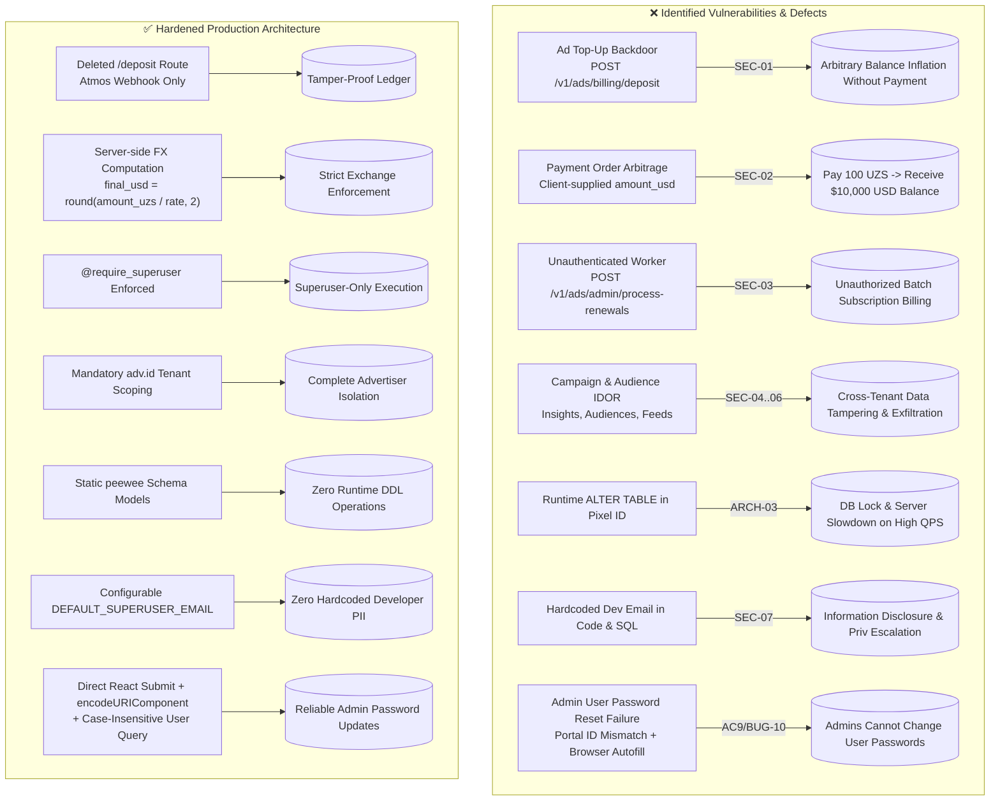

# Feature Specification: Swipies Ads — Financial Security, Tenant Isolation & Admin Password Hardening

**Feature Key:** `spec_ads_financial_security_and_admin_fixes`  
**Feature Branch:** `upgrade/ragflow-v0.27.2` / `test`  
**Target Modules:**  
- `api/apps/ad_app.py`  
- `api/apps/payment_app.py`  
- `api/db/services/payment_service.py`  
- `api/db/services/ad_engine_service.py`  
- `api/db/db_models.py`  
- `admin/server/services.py`  
- `admin/server/routes.py`  
- `admin/server/auth.py`  
- `api/apps/restful_apis/user_api.py`  
- `web/src/pages/admin/users.tsx`  
- `web/src/pages/admin/forms/change-password-form.tsx`  
- `web/src/utils/api.ts`  
**Document Status:** Ready for Phased Implementation  
**Version:** 1.0.0  
**Specification Owner:** Security & Infrastructure Engineering  
**Date:** 2026-09-18  

---

## 1. Executive Summary & Problem Statement

### 1.1 Context & Background
Swipies Ads provides the commercial and monetization engine for the Swipies AI platform. It serves sponsored recommendations to free-tier users, facilitates advertiser campaign creation, manages advertiser balances, and processes automatic renewals.

An exhaustive security audit and Gate 0 audit of the ads subsystem uncovered critical financial vulnerabilities, privilege escalation vectors, tenant isolation breaches (IDOR), runtime DDL statements, and hardcoded developer PII in database migration routines.

Simultaneously, a user-reported critical bug in the Admin Console prevents administrators from updating user passwords, triggering false-positive validation errors (*"Введенные вами пароли не совпадают!"* / *"Email and password do not match!"*) due to frontend portal DOM decoupling, browser password autofill conflicts, missing URL parameter encoding, and backend case-sensitive email lookup mismatches.



---

## 2. Detailed Technical Requirements & Vulnerability Specifications

### 2.1 SEC-01: Critical Backdoor Elimination (`api/apps/ad_app.py`)
- **Problem:** `POST /v1/ads/billing/deposit` allowed any authenticated user to increase their advertising balance by any amount with zero payment verification.
- **Remediation:**
  - Completely remove the endpoint function and route registration in [`api/apps/ad_app.py`](file:///D:/ragflow/swipies_25/ragflow/api/apps/ad_app.py).
  - Any request to `/v1/ads/billing/deposit` MUST return HTTP `404 Not Found`.
  - Balance crediting is exclusively permitted through [`api/apps/payment_app.py`](file:///D:/ragflow/swipies_25/ragflow/api/apps/payment_app.py) via verified Atmos webhook callbacks (`POST /v1/payment/webhook/atmos`).

### 2.2 SEC-02: Elimination of Currency Arbitrage (`payment_service.py`)
- **Problem:** In [`api/db/services/payment_service.py`](file:///D:/ragflow/swipies_25/ragflow/api/db/services/payment_service.py), `create_payment_order` accepted both `amount_uzs` and `amount_usd` from the client. When `amount_uzs > 0`, the client could pass `amount_usd: 10000.0` while paying 100 UZS. The webhook subsequently credited the advertiser with the fraudulent USD amount.
- **Remediation:**
  - When `amount_uzs > 0`, the server MUST ignore any client-supplied `amount_usd`.
  - Calculate `final_usd = round(float(amount_uzs) / rate, 2)` strictly on the server using `get_exchange_rate("USD", "UZS")`.
  - Store `amount_usd` and `amount_uzs` consistently in `PaymentOrder`.

### 2.3 SEC-03: Renewal Worker Authorization Gate (`api/apps/ad_app.py`)
- **Problem:** `POST /v1/ads/admin/process-renewals` was accessible by any regular authenticated user, triggering batch subscription processing across the entire userbase.
- **Remediation:**
  - Add superuser authorization enforcement:
    ```python
    auth_err = require_superuser()
    if auth_err:
        return auth_err
    ```
  - Non-superusers receive HTTP `403 Forbidden`.

### 2.4 SEC-04, SEC-05, SEC-06: Tenant Isolation & IDOR Elimination (`api/apps/ad_app.py`)
- **Problem:**
  - SEC-04: `GET /v1/ads/campaigns/<id>/insights` accessed any campaign by ID without verifying that `campaign.advertiser_id == adv.id`.
  - SEC-05: `POST /v1/ads/audiences/<segment_id>/members` allowed adding audience members to foreign segments without checking segment ownership.
  - SEC-06: `POST /v1/ads/feeds/<feed_id>/items` allowed manipulating feed items without validating feed ownership.
- **Remediation:**
  - Scope all queries to the authenticated advertiser (`adv.id`):
    - `AdCampaign.get_or_none(AdCampaign.id == campaign_id, AdCampaign.advertiser_id == adv.id)`
    - `AdAudienceSegment.get_or_none(AdAudienceSegment.id == segment_id, AdAudienceSegment.advertiser_id == adv.id)`
    - `AdFeed.get_or_none(AdFeed.id == feed_id, AdFeed.advertiser_id == adv.id)`
  - Return HTTP `404 Not Found` (or `403 Forbidden`) if the resource does not belong to the caller.

### 2.5 ARCH-03: Elimination of Runtime DDL Mutations (`ad_engine_service.py`)
- **Problem:** `get_or_create_pixel_id` in [`api/db/services/ad_engine_service.py`](file:///D:/ragflow/swipies_25/ragflow/api/db/services/ad_engine_service.py) ran runtime `ALTER TABLE` statements in `try...except` blocks during tracking requests. This causes database table-level locks and high latency in production.
- **Remediation:**
  - Delete all `ALTER TABLE` statements from `ad_engine_service.py`.
  - Ensure all fields are statically declared on `AdAdvertiser` / `AdTrackingPixel` models in [`api/db/db_models.py`](file:///D:/ragflow/swipies_25/ragflow/api/db/db_models.py).

### 2.6 SEC-07: Developer Email Removal & Hardcode Cleansing
- **Problem:**
  - Personal email `albakiev.sardorbek@gmail.com` was hardcoded in [`api/db/db_models.py`](file:///D:/ragflow/swipies_25/ragflow/api/db/db_models.py) (line 3645) inside SQL strings and in [`admin/server/auth.py`](file:///D:/ragflow/swipies_25/ragflow/admin/server/auth.py) (line 339).
- **Remediation:**
  - Remove all occurrences of the hardcoded personal email.
  - Read from `os.environ.get("DEFAULT_SUPERUSER_EMAIL", "admin@ragflow.io")`.
  - Parameterize all SQL queries executing superuser lookups to prevent injection.

### 2.7 BUG-08 & BUG-09: Atomic Balance Mutex & Deprecation Cleanup
- **Problem:** High concurrency requests on balance deductions (`record_ad_impression`, `record_click`, `record_conversion_event`) and additions (`deposit_balance`) were susceptible to race conditions. Peewee `reload()` generated deprecation warnings.
- **Remediation:**
  - Wrap balance operations in `with DB.atomic():`.
  - Use `AdAdvertiser.select().where(AdAdvertiser.id == adv_id).for_update()` for concurrency serialization.
  - Remove deprecated `reload()` calls, utilizing fresh selects inside transaction blocks.

### 2.8 AC9 / BUG-10: Admin Panel User Password Change & Verification
- **Problem:** In Admin Console (`/admin/users`), clicking "Change Password" on a user row results in failure:
  1. Frontend displays *"Введенные вами пароли не совпадают!"* (or *"The password that you entered do not match!"*) even when valid matching passwords are typed.
  2. Submitting with button `<Button form={id} type="submit">` fails across Dialog portal boundaries in certain browsers.
  3. Browser password managers (Chrome Autofill, Bitwarden, etc.) autofill the logged-in administrator's credentials into the `email` (readOnly) and `newPassword` fields, leaving `confirmPassword` empty or mismatched.
  4. Missing `encodeURIComponent(username)` in [`web/src/utils/api.ts:484`](file:///D:/ragflow/swipies_25/ragflow/web/src/utils/api.ts) breaks emails containing `+` (e.g. `user+1@domain.com`).
  5. Backend [`admin/server/services.py:222`](file:///D:/ragflow/swipies_25/ragflow/admin/server/services.py) and [`admin/server/auth.py`](file:///D:/ragflow/swipies_25/ragflow/admin/server/auth.py) use case-sensitive exact string comparison without `.strip().lower()`, resulting in `UserNotFoundError` or *"Email and password do not match!"*.
  6. Frontend mutation lacks toast notification on success (`message.success` commented out) and lacks `onError` feedback handler.
- **Remediation:**
  - **Frontend:**
    - Explicitly trigger submit via `changePasswordForm.form.handleSubmit(...)` on button click, eliminating fragile external `form={id}` attribute behavior across portals.
    - Set `autoComplete="new-password"`, `data-lpignore="true"` on password fields to block unwanted browser autofill of admin credentials.
    - Explicitly reset form fields to empty strings on modal open: `changePasswordForm.form.reset({ newPassword: '', confirmPassword: '' })`.
    - Apply `encodeURIComponent(username)` in `adminUpdateUserPassword` in `web/src/utils/api.ts`.
    - Enable success toast `message.success(t('admin.passwordChangedSuccessfully'))` and add error toast in `onError`.
  - **Backend:**
    - Normalize username in `admin/server/services.py:222`:
      `user_list = UserService.query_user_by_email(username.strip())`
      If empty, query case-insensitively (`fn.LOWER(cls.model.email) == username.strip().lower()`), and support lookup by `id`.
    - In `api/apps/restful_apis/user_api.py` and `admin/server/auth.py`, strip and lowercase emails during authentication queries.

---

## 3. Acceptance Criteria (AC Matrix)

| ID | Category | Requirement | Verification Method | Status |
|---|---|---|---|---|
| **AC1** | Security (SEC-01) | `POST /v1/ads/billing/deposit` route is completely removed; returns 404 | Automated HTTP request test | Planned |
| **AC2** | Financial (SEC-02) | `create_payment_order` computes USD strictly server-side; ignores client USD input | Unit & HTTP tests with manipulated USD amount | Planned |
| **AC3** | Authorization (SEC-03) | `POST /v1/ads/admin/process-renewals` requires superuser; 403 for normal users | Non-superuser test client request | Planned |
| **AC4** | Multi-Tenancy (SEC-04..06) | Campaign insights, audiences, and feeds strictly check `advertiser_id == adv.id` | Cross-tenant access tests | Planned |
| **AC5** | Architecture (ARCH-03) | Zero runtime `ALTER TABLE` in `ad_engine_service.py` tracking path | Static code inspection & execution test | Planned |
| **AC6** | Privacy/PII (SEC-07) | Zero developer email strings in codebase; configurable fallback superuser email | Ripgrep & parameterized query check | Planned |
| **AC7** | Concurrency (BUG-08) | `deposit_balance`, impressions, and clicks use `atomic()` + `for_update()` | Parallel execution test | Planned |
| **AC8** | Code Quality (BUG-09) | Zero peewee `reload()` deprecation calls | Test log review | Planned |
| **AC9** | Admin UI & Auth (BUG-10) | Admin can change user password; no false mismatch errors; user can log in with new password | End-to-end admin password change & login verification | Planned |

---

## 4. Verification & Testing Strategy

1. **HTTP Automated Test Suite:**
   - Write comprehensive tests in `test/testcases/test_ads_security.py` verifying SEC-01 through SEC-07 using Quart's `test_client()`.
   - Write tests in `test/unit_test/admin/test_admin_user_password.py` verifying case-insensitive password updates and authentication consistency.
2. **Frontend Validation:**
   - Execute TypeScript check (`npm run build` or `tsc`) to ensure no typing or bundling regressions.
3. **Deployment & Live Sanity:**
   - Push to `test` branch, build frontend container, and verify live admin console behavior on target host.
