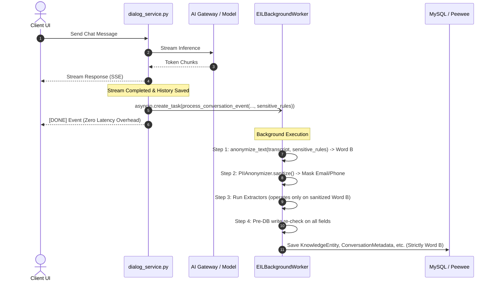
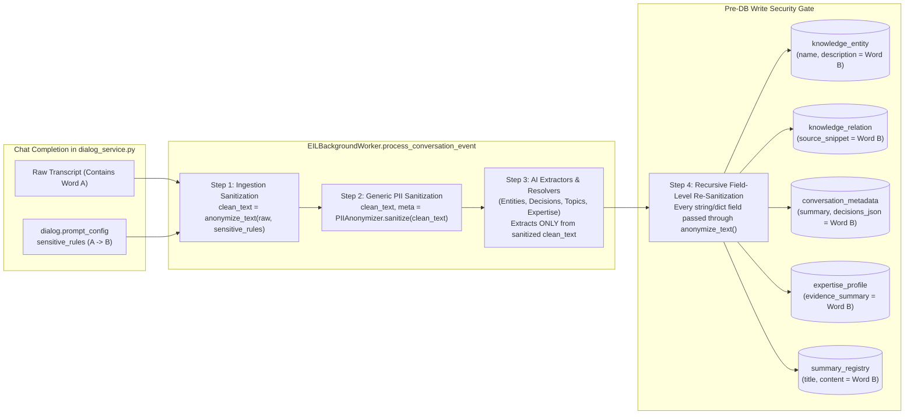
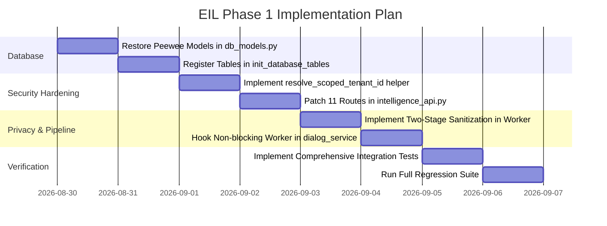

# Feature Specification: Enterprise Intelligence Layer (EIL) — Foundation & Security Hardening (Phase 1)

**Feature Key:** `spec_eil_foundation_and_security_hardening`  
**Target Modules:**  
- `api/db/db_models.py`  
- `api/db/services/intelligence_service.py`  
- `api/apps/restful_apis/intelligence_api.py`  
- `rag/intelligence/pipeline/worker.py`  
- `rag/intelligence/security/anonymizer.py`  
- `api/db/services/dialog_service.py`  
- `test/test_intelligence_layer.py`  
**Document Status:** Ready for Review  
**Version:** 1.1.0  
**Specification Owner:** Security & Core Architecture Team  
**Date:** 2026-08-29  

---

## 1. Executive Summary & Problem Statement

### 1.1 Context & Background
The Enterprise Intelligence Layer (EIL) is designed to extract structured business intelligence (decisions, action items, unresolved questions, domain expertise signals, topics, and knowledge graphs) from user dialogues and organizational onboarding questionnaires.

However, during branch reconciliation and development iterations, the underlying database schemas were partially lost in [`api/db/db_models.py`](file:///D:/ragflow/swipies_25/ragflow/api/db/db_models.py), while the service and API layers were left active. Furthermore, an architectural and security audit revealed severe vulnerabilities and disconnected components in the current branch `test`.

```mermaid
flowchart TD
    subgraph CurrentVulnerableState [❌ Current Vulnerable & Broken State]
        UI["React Admin / Regular User"] -->|GET /v1/intelligence/export/excel?global=true| API["intelligence_api.py (No Admin Check)"]
        API -->|Leak All Tenant PII| DB1[("UserOnboarding (All Users Dumped)")]
        API -->|Runtime Exception / 500| DB2[("Missing Tables: KnowledgeEntity, ConversationMetadata...")]
        CHAT["dialog_service.py"] -.->|Never Called / Disconnected| WORKER["EILBackgroundWorker (Dead Code)"]
    end

    subgraph HardenedPhase1State [✅ Hardened Phase 1 Architecture]
        USER["Tenant User (Regular)"] -->|Requests with tenant_id| GATED_API["intelligence_api.py<br/>(Enforced Tenant Isolation)"]
        ADMIN["Superuser (admin@ragflow.io)"] -->|Requests global=true| GATED_API
        GATED_API -->|Strict Scope| RESTORED_DB[("Restored DB Models & Tables with tenant_id Index")]
        
        CHAT_SVC["dialog_service.py"] -->|asyncio.create_task (Non-blocking)| EIL_WORKER["EILBackgroundWorker"]
        EIL_WORKER -->|Step 1: tenant sensitive_rules A->B<br/>Step 2: PIIAnonymizer email/phone<br/>Step 3: Pre-DB write assertion| RESTORED_DB
    end
```

---

### 1.2 Critical Defects & Security Findings

1. **Critical IDOR & Data Leakage (`intelligence_api.py`):**
   - All 11 REST endpoints in [`api/apps/restful_apis/intelligence_api.py`](file:///D:/ragflow/swipies_25/ragflow/api/apps/restful_apis/intelligence_api.py) use only `@login_required` without `@require_superuser` or administrative role validation.
   - The query parameter `global` defaults to `"true"`, which immediately drops tenant filtering (`tenant_id = None`).
   - **Impact:** Any authenticated low-privilege user can download the complete CSV export of all user onboarding data (`/v1/intelligence/export/excel?global=true`), exposing email addresses, names, company names, industry sectors, and organizational roles across all tenants.
2. **Missing Database Models & Runtime 500s:**
   - [`api/db/services/intelligence_service.py`](file:///D:/ragflow/swipies_25/ragflow/api/db/services/intelligence_service.py) imports `KnowledgeEntity`, `KnowledgeRelation`, `ConversationMetadata`, `ExpertiseProfile`, `SummaryRegistry`, and `EILAuditLog` from `api.db.db_models`.
   - None of these classes exist in [`api/db/db_models.py`](file:///D:/ragflow/swipies_25/ragflow/api/db/db_models.py). Service invocations fail silently into `except Exception` blocks or throw runtime `AttributeError`/`OperationalError`.
3. **Dead Pipeline Worker:**
   - [`rag/intelligence/pipeline/worker.py`](file:///D:/ragflow/swipies_25/ragflow/rag/intelligence/pipeline/worker.py) (`EILBackgroundWorker`) is completely decoupled from [`api/db/services/dialog_service.py`](file:///D:/ragflow/swipies_25/ragflow/api/db/services/dialog_service.py). No conversation events are processed or recorded in real-time.
4. **Privacy System Disconnect & Plaintext Entity Risk:**
   - `PIIAnonymizer` in `rag/intelligence/security/anonymizer.py` operates in total isolation with two primitive regex patterns (email and phone), completely ignoring the platform's `sensitive_data_replacement` subsystem ($A \to B$ placeholder engine).
   - If an entity extractor extracts a person's real name (Word A), without strict integration it would be written to `knowledge_entity.name` in plaintext, creating an un-redacted parallel intelligence graph.

---

## 2. Scope of Phase 1

### In Scope (Phase 1)
- **Database Schema Restoration:** Implement Peewee ORM classes for `KnowledgeEntity`, `EntityAlias`, `KnowledgeRelation`, `ConversationMetadata`, `ExpertiseProfile`, `SummaryRegistry`, and `EILAuditLog` in [`api/db/db_models.py`](file:///D:/ragflow/swipies_25/ragflow/api/db/db_models.py) with database initialization.
- **Access Control & IDOR Hardening:**
  - Secure all 11 endpoints in [`api/apps/restful_apis/intelligence_api.py`](file:///D:/ragflow/swipies_25/ragflow/api/apps/restful_apis/intelligence_api.py).
  - Cross-tenant data access (`global=true`) and administrative export (`/intelligence/export/excel`) strictly restricted to superusers (`current_user.is_superuser == True`).
  - Regular tenant users are strictly scoped to their own `tenant_id`. Any attempt by a non-superuser to supply `global=true` is automatically overridden to `tenant_id = current_user.tenant_id` (fail-safe).
- **Asynchronous Chat Pipeline Hook:** Integrate `EILBackgroundWorker.process_conversation_event()` non-blockingly into [`api/db/services/dialog_service.py`](file:///D:/ragflow/swipies_25/ragflow/api/db/services/dialog_service.py) via `asyncio.create_task` or a background thread pool, with zero impact on chat latency or availability.
- **Strict Privacy Contract with `sensitive_data_replacement`:** Technical enforcement guaranteeing that zero Word A sensitive terms ever reach EIL tables.
- **Security & Multi-Tenant Regression Test Suite:** Comprehensive test coverage validating database persistence, IDOR prevention, tenant boundary isolation, and database-wide zero-plaintext assertion.

### Out of Scope (Deferred to Phases 2–4)
- Frontend graph UI rendering improvements and D3 force-graph interactivity.
- Real-time LLM-based What-If simulation algorithm optimizations.
- Dynamic project Wiki generation and FAQ automated article drafting logic.

---

## 3. Acceptance Criteria & Requirements

### AC-1: Database Schema Restoration & Service Stability
1. The following Peewee model classes MUST be defined in [`api/db/db_models.py`](file:///D:/ragflow/swipies_25/ragflow/api/db/db_models.py):
   - `KnowledgeEntity` (fields: `id`, `tenant_id`, `name`, `entity_type`, `description`, `canonical_id`, `attributes`, `confidence_score`) -> table `knowledge_entity`.
   - `EntityAlias` (fields: `id`, `tenant_id`, `alias_name`, `entity_id`, `source_type`) -> table `entity_alias`.
   - `KnowledgeRelation` (fields: `id`, `tenant_id`, `src_entity_id`, `predicate`, `dst_entity_id`, `weight`, `confidence_score`, `conversation_id`, `document_id`, `source_snippet`) -> table `knowledge_relation`.
   - `ConversationMetadata` (fields: `id`, `conversation_id`, `tenant_id`, `user_id`, `department`, `project_id`, `topics`, `tags`, `summary`, `decisions_json`, `action_items_json`, `unresolved_questions`, `referenced_doc_ids`, `models_used`, `agents_involved`, `language`, `duration_seconds`) -> table `conversation_metadata`.
   - `ExpertiseProfile` (fields: `id`, `tenant_id`, `user_id`, `domain_topic`, `confidence_score`, `depth_level`, `contribution_count`, `evidence_summary`, `last_active_at`) -> table `expertise_profile`.
   - `SummaryRegistry` (fields: `id`, `tenant_id`, `summary_type`, `target_id`, `title`, `content`, `key_decisions`, `key_risks`, `trending_topics`, `period_start`, `period_end`) -> table `summary_registry`.
   - `EILAuditLog` (fields: `id`, `tenant_id`, `operator_id`, `action`, `resource_type`, `resource_id`, `details`, `ip_address`) -> table `eil_audit_log`.
2. All tables MUST be registered in `init_database_tables()` in [`api/db/db_models.py`](file:///D:/ragflow/swipies_25/ragflow/api/db/db_models.py) to guarantee automatic creation on system bootstrap.
3. `KnowledgeEntityService`, `EnterpriseSearchService`, `ExecutiveDigestService`, `ProactiveIntelligenceService`, and `ExpertiseService` in [`api/db/services/intelligence_service.py`](file:///D:/ragflow/swipies_25/ragflow/api/db/services/intelligence_service.py) MUST execute queries without unhandled exceptions or missing model errors.

---

### AC-2: Access Control Enforcement & IDOR Remediation
1. **Administrative Export (`/v1/intelligence/export/excel`):**
   - MUST verify `current_user.is_superuser`.
   - If `current_user.is_superuser` is `False`, the endpoint MUST return HTTP 403 Forbidden (`RetCode.AUTHENTICATION_ERROR` / "Permission denied").
2. **Tenant Isolation Helper:**
   - A unified tenant resolution function MUST be used across all routes in [`api/apps/restful_apis/intelligence_api.py`](file:///D:/ragflow/swipies_25/ragflow/api/apps/restful_apis/intelligence_api.py):
     ```python
     def resolve_scoped_tenant_id(user, requested_global: bool) -> str | None:
         if requested_global and getattr(user, "is_superuser", False):
             return None  # Global query allowed for superusers only
         # Non-superusers are strictly forced into their own tenant
         return getattr(user, "tenant_id", None) or getattr(user, "id", "")
     ```
3. **Route Coverage:**
   - The tenant resolution logic MUST be applied to all 11 endpoints:
     - `GET /v1/intelligence/graph/full`
     - `POST /v1/intelligence/graph/query`
     - `POST /v1/intelligence/search`
     - `GET /v1/intelligence/dashboard/executive`
     - `GET /v1/intelligence/analytics/sentiment`
     - `GET /v1/intelligence/analytics/roi`
     - `GET /v1/intelligence/timeline`
     - `POST /v1/intelligence/faq/generate`
     - `POST /v1/intelligence/wiki/build`
     - `POST /v1/intelligence/simulator/whatif`
     - `GET /v1/intelligence/dashboard/stats`
4. **IDOR Regression Protection:**
   - Non-admin queries specifying `?global=true` or attempting to inspect other tenants MUST never return cross-tenant data.

---

### AC-3: Non-Blocking Chat Pipeline Integration
1. **Trigger Point:**
   - In [`api/db/services/dialog_service.py`](file:///D:/ragflow/swipies_25/ragflow/api/db/services/dialog_service.py), upon the completion of a chat turn (both in `async_chat_solo` and knowledgebase streaming `chat`), an asynchronous background task MUST be dispatched to `EILBackgroundWorker.process_conversation_event()`.
2. **Parameters Passed:**
   - `tenant_id`: Current tenant ID (`dialog.tenant_id`).
   - `conversation_id`: Current conversation ID.
   - `user_id`: Current user ID.
   - `text_transcript`: Formatted transcript string containing user query and assistant response.
   - `sensitive_rules`: Tenant-specific substitution rules (`dialog.prompt_config.get("sensitive_data_replacement", {}).get("rules", [])`).
3. **Resilience & Fault Isolation:**
   - The invocation MUST be wrapped in a fire-and-forget, non-blocking execution model (e.g. `asyncio.create_task` or background worker).
   - Any exception, timeout, or processing failure inside `EILBackgroundWorker` MUST be caught and logged as a warning; it MUST NEVER interrupt the SSE stream or raise an HTTP 500 error to the client.



---

### AC-4: Technical Privacy Contract & Sensitive Data Replacement Enforcement



#### AC-4.1: Ingestion State Contract
1. `EILBackgroundWorker.process_conversation_event()` accepts `text_transcript` alongside the explicit `sensitive_rules` list from `dialog.prompt_config`.
2. **First Line of Worker Execution:**
   - Before any parsing or extraction begins, `text_transcript` MUST be sanitized via:
     ```python
     # 1. Transform all tenant-configured sensitive terms (Word A -> Word B)
     if sensitive_rules:
         text_transcript = anonymize_text(text_transcript, sensitive_rules)
     # 2. General PII sanitization (Emails, Phone numbers)
     clean_text, pii_meta = PIIAnonymizer.sanitize(text_transcript)
     ```
3. **No Unsanitized Text Passed to Plugins:** All extractor plugins (`EntityExtractorPlugin`, `DecisionExtractorPlugin`, `TopicExtractorPlugin`, `ExpertiseExtractorPlugin`) and LLM extraction prompts MUST receive **ONLY `clean_text`** (where all Word A terms have been replaced by Word B placeholders).

#### AC-4.2: Field-Level Pre-DB Write Gate across ALL EIL Tables
To prevent any model hallucination or partial extraction leak from inserting Word A into graph nodes or summaries, a mandatory field sanitizer helper `_clean_val(val)` MUST be executed before every Peewee `.create()` / `.update()` call:

1. **`knowledge_entity` & `entity_alias`:**
   - `KnowledgeEntity.name = _clean_val(entity.get("name"))` — **CRITICAL:** Graph node labels (e.g. names of individuals, secret projects) MUST be stored as `"[CLIENT_NAME]"` (Word B) and NEVER as `"Иван Иванов"` (Word A).
   - `KnowledgeEntity.description = _clean_val(entity.get("description"))`
   - `EntityAlias.alias_name = _clean_val(alias.get("alias_name"))`
2. **`knowledge_relation`:**
   - `KnowledgeRelation.source_snippet = _clean_val(clean_text[:255])`
3. **`conversation_metadata`:**
   - `ConversationMetadata.summary = _clean_val(decision_data.get("summary", ""))`
   - `ConversationMetadata.decisions_json = _clean_json_structure(decision_data.get("decisions", []))`
   - `ConversationMetadata.action_items_json = _clean_json_structure(decision_data.get("action_items", []))`
   - `ConversationMetadata.unresolved_questions = _clean_json_structure(decision_data.get("unresolved_questions", []))`
4. **`expertise_profile`:**
   - `ExpertiseProfile.evidence_summary = _clean_val(sig.get("reasoning", ""))`
5. **`summary_registry`:**
   - `SummaryRegistry.title = _clean_val(summary.get("title"))`
   - `SummaryRegistry.content = _clean_val(summary.get("content"))`
   - `SummaryRegistry.key_decisions = _clean_json_structure(summary.get("key_decisions"))`

---

### AC-5: Storage & Encryption at Rest Policy
1. **Storage Format:**
   - Plaintext JSON and text storage in relational database columns (`conversation_metadata`, `knowledge_entity`, `summary_registry`, `user_onboarding`) is ACCEPTED for Phase 1.
2. **Justification & Threat Model:**
   - Matches the standard security level of core conversation logs in `Conversation.message` and `Dialog.prompt_config`.
   - Security and compliance boundaries are enforced via:
     - Mandatory row-level tenant filtering (`tenant_id` on all tables and queries).
     - Strict superuser RBAC for cross-tenant visibility.
     - Enterprise database storage volume encryption (LUKS / AWS EBS Encryption at Rest / RDS TDE).

---

### AC-6: Verification & Test Suite

The automated test suite in [`test/test_intelligence_layer.py`](file:///D:/ragflow/swipies_25/ragflow/test/test_intelligence_layer.py) MUST implement the following mandatory test cases:

1. **AC-6.1 (Database-Wide Zero-Plaintext Assertion):**
   - Configure a mock dialog with the rule: `{"search_val": "Иван Иванов", "replace_val": "[CLIENT_NAME]", "is_regex": False}`.
   - Run a conversation turn with transcript: `"Согласовано с Иван Иванов. Ответственный: Иван Иванов. Проект: Секретный Проект А."` (where `"Секретный Проект А"` $\to$ `"[PROJECT_ALPHA]"`).
   - Execute `EILBackgroundWorker.process_conversation_event()`.
   - Execute direct SQL assertions across **ALL** tables:
     - `knowledge_entity`: Verify `name` and `description` contain `"[CLIENT_NAME]"` / `"[PROJECT_ALPHA]"` and **0 occurrences** of `"Иван Иванов"` or `"Секретный Проект А"`.
     - `knowledge_relation`: Verify `source_snippet` contains `0 occurrences` of `"Иван Иванов"`.
     - `conversation_metadata`: Verify `summary`, `decisions_json`, `action_items_json` contain `0 occurrences` of `"Иван Иванов"`.
     - `expertise_profile`: Verify `evidence_summary` contains `0 occurrences` of `"Иван Иванов"`.
     - `summary_registry`: Verify `title` and `content` contain `0 occurrences` of `"Иван Иванов"`.
2. **AC-6.2 (IDOR Regression Test):**
   - Authenticate as a normal user (`is_superuser = False`, `tenant_id = "tenant_user_123"`).
   - Request `GET /v1/intelligence/export/excel?global=true` -> Assert HTTP 403 Forbidden.
   - Request `GET /v1/intelligence/graph/full?global=true` -> Assert that returned nodes/edges contain **ONLY** items with `tenant_id == "tenant_user_123"`.
3. **AC-6.3 (Multi-Tenant Isolation Test):**
   - Seed distinct knowledge entities and conversation metadata for `tenant_alpha` and `tenant_beta`.
   - Perform queries from `tenant_alpha` -> Assert that 0 records from `tenant_beta` are returned.
4. **AC-6.4 (Superuser Cross-Tenant Access):**
   - Authenticate as superuser (`is_superuser = True`, `email = "admin@ragflow.io"`).
   - Request `GET /v1/intelligence/dashboard/stats?global=true` -> Assert aggregates reflect totals across all tenants.
5. **AC-6.5 (Database Schema & Service Resilience):**
   - Verify that calling `KnowledgeEntityService`, `EnterpriseSearchService`, `ExecutiveDigestService`, and `ProactiveIntelligenceService` against empty tables returns clean empty JSON structures without throwing Peewee or DB exceptions.
6. **AC-6.6 (Non-blocking Chat Execution):**
   - Trigger a simulated chat turn in `dialog_service.py` where `EILBackgroundWorker` is mocked to raise an exception -> Verify that the chat response completes with 100% success and the error is cleanly trapped in logger.

---

## 4. Implementation Phasing & Next Steps



---

## 5. Review & Sign-Off Checklist

- [ ] Peewee models in `db_models.py` match historical definitions and Peewee v3 syntax.
- [ ] No route in `intelligence_api.py` allows non-superusers to access un-scoped cross-tenant data.
- [ ] `KnowledgeEntity.name` and all EIL table fields are strictly sanitized via `anonymize_text()` before write.
- [ ] Chat latency in `dialog_service.py` is completely unimpacted by background intelligence extraction.
- [ ] All 6 Acceptance Criteria (AC-1 through AC-6) are covered by automated unit and integration tests.
