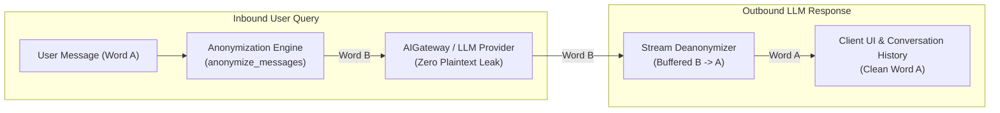
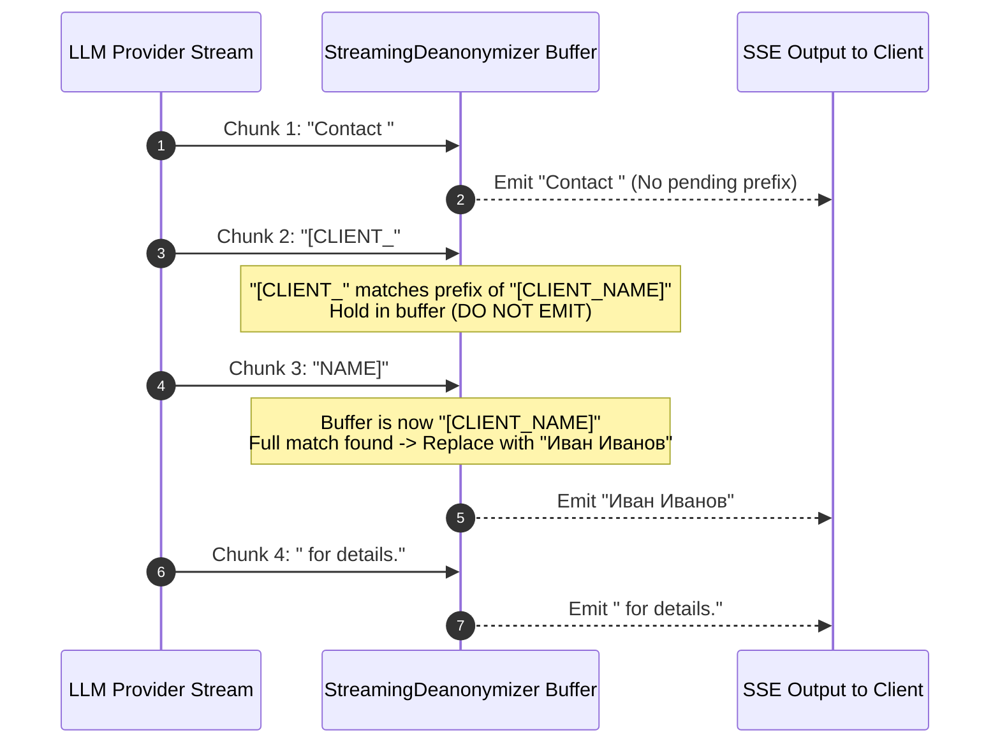

# Feature Specification: Sensitive Data Replacement & Stream Deanonymization Fix

**Feature Key:** `spec_sensitive_data_replacement`  
**Target Modules:** `api/utils/sensitive_data_utils.py`, `api/db/services/dialog_service.py`, `test/test_sensitive_data_replacement.py`  
**Document Status:** Ready for Review  
**Version:** 1.0.0  
**Specification Owner:** AI Architecture Team / Antigravity Assistant  
**Date:** 2026-08-27  

---

## 1. Executive Summary & Problem Statement

### 1.1 Context & Background
The Swipies AI platform provides a **Sensitive Data Replacement (Word Substitution)** feature configured per-assistant (`dialog.prompt_config["sensitive_data_replacement"]`). The primary security objective is to prevent sensitive information (e.g. personal customer names, credit card numbers, confidential project codenames, API keys) from being transmitted in plaintext to external LLM providers (OpenAI, Anthropic, DeepSeek, Gemini).

The user defines substitution rules ($A \to B$), where $A$ is the real sensitive term (e.g. `"Иван Иванов"`, `"ACME_SECRET"`) and $B$ is an opaque placeholder (e.g. `"[CLIENT_NAME]"`, `"[PROJECT_X]"`).



### 1.2 Identified Critical Defects & Gaps

1. **Fatal Crash in Direct Solo Chat (`async_chat_solo`):**
   - In [`api/db/services/dialog_service.py:L340, L348, L356`](file:///D:/ragflow/swipies_25/ragflow/api/db/services/dialog_service.py#L340), `async_chat_solo` calls `deanonymize_text(value, sensitive_rules)` conditioned on `sensitive_enabled and sensitive_rules`.
   - However, `sensitive_enabled` and `sensitive_rules` are neither passed as arguments nor extracted from `dialog.prompt_config` inside `async_chat_solo`.
   - **Impact:** Any chat without an attached Knowledge Base or Tavily Web Search crashes immediately with `NameError: name 'sensitive_enabled' is not defined` (HTTP 500), breaking the single most common chat use case.

2. **Visual Placeholder Leakage during SSE Token Streaming:**
   - In [`dialog_service.py:L952`](file:///D:/ragflow/swipies_25/ragflow/api/db/services/dialog_service.py#L952), `deanonymize_text(value, sensitive_rules)` is invoked *statelessly* on individual chunk deltas (`value`).
   - When an LLM vendor streams tokens that slice placeholder $B$ across chunk boundaries (e.g. Chunk 1: `"[CLIENT_"`, Chunk 2: `"NAME]"`):
     - Neither chunk individually matches the full placeholder regex `\[CLIENT_NAME\]`.
     - Raw fragments (`"[CLIENT_"`, `"NAME]"`) are emitted immediately to the client in SSE data events, visually exposing the technical placeholder to the end user.
   - **Impact:** Compromises user experience and undermines trust in the privacy shield.

3. **Sub-string Word Corruption (No Word Boundaries):**
   - In [`api/utils/sensitive_data_utils.py:L47-L48`](file:///D:/ragflow/swipies_25/ragflow/api/utils/sensitive_data_utils.py#L47-L48), plaintext search patterns (`is_regex = False`) use raw `re.escape(search_val)` without word boundary delimiters (`\b`).
   - **Impact:** A rule for `"cat"` $\to$ `"[ANIMAL]"` corrupts innocent words, transforming `"category of catastrophe"` into `"[ANIMAL]egory of [ANIMAL]astrophe"`.

4. **Zero Test Coverage:**
   - There are currently zero unit or integration tests for `sensitive_data_utils.py` or the sensitive data replacement flows in `dialog_service.py`.

---

## 2. Scope & Architectural Boundaries

```mermaid
flowchart TD
    subgraph InScope [✅ IN SCOPE (This Specification)]
        S1["Fix NameError in async_chat_solo (resolve sensitive_config)"]
        S2["Stateful StreamingDeanonymizer with Sliding Window Lookahead Buffer"]
        S3["Word-Boundary Boundary Matching (\b) for Plaintext Rules"]
        S4["Full Test Suite in test/test_sensitive_data_replacement.py (100% Pass)"]
        S5["Preserve Word A persistence in Conversation DB history"]
    end

    subgraph OutOfScope [❌ OUT OF SCOPE (Explicit Architecture Decision)]
        O1["Rewriting RAG Knowledgebase retrieval to use Word A"]
        O2["Global / Per-User substitution dictionary overrides"]
        O3["Multimodal image OCR text substitution"]
    end
```

> [!IMPORTANT]
> **Explicit Architectural Decision on RAG Search Queries:**
> RAG retrieval (vector similarity search, Tavily web search, Text-to-SQL, MindMap generation) will continue to execute with the anonymized query (containing Word B). Because anonymization is evaluated at the entry point before retrieval queries are formulated, decoupling search query expansion from LLM prompt anonymization represents a separate, broader architecture initiative and is strictly **OUT OF SCOPE** for this fix.

---

## 3. User Stories & Acceptance Criteria

### 3.1 User Stories
- **US-1 (Reliable Solo Chat):** *As a user chatting with an assistant without a Knowledge Base, I can use sensitive data replacement without encountering 500 errors or application crashes.*
- **US-2 (Seamless Streaming Experience):** *As an end-user watching real-time streaming answers, I never see raw placeholders (like `[CLIENT_NAME]`) flash or appear on screen, even if the AI model streams the response in micro-token chunks.*
- **US-3 (Natural Language Integrity):** *As an assistant administrator configuring a word replacement like `"bank"` $\to$ `"[FINANCIAL_INSTITUTION]"`, the assistant does not mistakenly replace parts of words like `"banking"` or `"embankment"` unless I explicitly use regex.*
- **US-4 (Security & DB Privacy):** *As a compliance officer, I am guaranteed that plaintext sensitive data is never dispatched to AI providers, while the user's local conversation history in the database reliably preserves original wording for review.*

---

### 3.2 Key Acceptance Criteria (Gated Checklist)

- [x] **AC-1 (Solo Chat Fix & Parity):**
  - `async_chat_solo()` in `api/db/services/dialog_service.py` extracts `sensitive_config = (dialog.prompt_config or {}).get("sensitive_data_replacement") or {}`, `sensitive_enabled`, and `sensitive_rules` identically to `async_chat()`.
  - Both streaming and non-streaming modes in `async_chat_solo` execute substitution and deanonymization without `NameError`.

- [x] **AC-2 (Stateful Streaming Deanonymizer Buffer & Latency Bounds):**
  - Implement a `StreamingDeanonymizer` class in `api/utils/sensitive_data_utils.py` that buffers incoming token chunks against potential partial matches of all active `replace` placeholders.
  - **Latency & Streaming Bounding:**
    - The buffer holds **at most** `max_prefix_len = max(len(rule['replace']) - 1)` characters, representing only the active tentative prefix of a placeholder.
    - All preceding characters that cannot be part of any active placeholder prefix are emitted **immediately ($O(1)$)** per incoming chunk, ensuring regular streaming text incurs zero perceptible delay or stutter.
  - **Match & Replacement:** When an incoming chunk completes a buffered placeholder prefix into a full match, the buffer is replaced with the corresponding `search_val` (Word A) and emitted cleanly.
  - **Forced Flush on Stream Termination / Interruption:**
    - On stream completion (`finish_reason: stop`, generator exhaustion, client cancellation, or connection disconnect), `flush(final=True)` is guaranteed to execute (e.g. via `try...finally`).
    - Any leftover incomplete buffer fragment (which turned out to be normal text, not a placeholder) is **flushed immediately to the client as-is**, guaranteeing **zero silently dropped or lost characters**.

- [x] **AC-3 (Whole-Word Boundary Matching for Plaintext Rules):**
  - In `anonymize_text()` and `deanonymize_text()`, when `is_regex` is `False`:
    - For search terms starting and ending with alphanumeric characters/underscores (`\w`), word boundary anchors `\b` are automatically wrapped around the escaped pattern (e.g. `r"\b" + re.escape(search_val) + r"\b"`).
    - For search terms containing leading/trailing punctuation or symbols (e.g. `"$100"`, `"+1-800-555"`), pattern matching respects punctuation boundaries without breaking valid symbol replacement.
  - When `is_regex` is `True`, the user's custom regular expression is applied directly without automatic `\b` wrapping.

- [x] **AC-4 (Case Sensitivity & Multiple Occurrences):**
  - `case_sensitive = False` applies `re.IGNORECASE` during both anonymization ($A \to B$) and deanonymization ($B \to A$).
  - Multiple occurrences of Word A in a single message or across multiple messages are 100% replaced.
  - Rules continue to be sorted by descending length of `search` / `replace` value to prevent substring collisions between rules.

- [x] **AC-5 (Conversation History DB Integrity):**
  - User messages in `conversation.message` remain stored with original Word A.
  - Assistant answers in `conversation.message` remain stored with restored Word A.

- [x] **AC-6 (Comprehensive Automated Test Suite):**
  - Implement `test/test_sensitive_data_replacement.py` covering:
    1. Plaintext word boundary isolation (`"cat"` does NOT replace `"category"`).
    2. Substring punctuation / symbol replacement (e.g. `"$100"`, `"user@acme.corp"`).
    3. Custom Regex rule mode (`is_regex = True`).
    4. Case sensitivity toggles (`case_sensitive = True/False`).
    5. Rule collision prevention (longer phrases matched before shorter substrings).
    6. `StreamingDeanonymizer` chunk boundary splitting (e.g. `["Hello, [", "CLIENT", "_NAME", "]!"]` correctly emits `["Hello, ", "Иван Иванов", "!"]` with zero placeholder leakage).
    7. `StreamingDeanonymizer` forced flush on uncompleted prefix at stream end (e.g. `["Looking at [", "OTHER_THING]"]` where `[OTHER` is not in rules -> flushes `"[OTHER_THING]"` completely without data loss).
    8. `StreamingDeanonymizer` latency benchmark: long normal response without placeholders emits each chunk immediately with zero artificial buffering delays.
    9. `async_chat_solo` end-to-end execution without `NameError`.
    10. Multiturn conversation message structure and DB payload verification.
  - **Goal:** 100% pass rate across all new and existing regression tests (56/56 + new tests).

---

## 4. Technical Design & Implementation Architecture

### 4.1 Whole-Word Boundary Anonymization Engine (`sensitive_data_utils.py`)

```python
def _build_rule_pattern(term: str, is_regex: bool = False) -> str:
    """
    Constructs a regex pattern for a search or replace term.
    Wraps alphanumeric boundaries with \b to avoid partial substring corruption.
    """
    if is_regex:
        return term
    
    escaped = re.escape(term)
    prefix = r"\b" if re.match(r"^\w", term) else ""
    suffix = r"\b" if re.match(r".*\w$", term) else ""
    return f"{prefix}{escaped}{suffix}"
```

### 4.2 Stateful Streaming Deanonymizer (`StreamingDeanonymizer`)



##### Buffer Algorithm Requirements:
1. Maintain internal string buffer `self.buffer`.
2. Compute `max_placeholder_len = max(len(rule['replace']) for rule in rules)`.
3. For each incoming chunk delta:
   - Append delta to `self.buffer`.
   - Identify the longest suffix of `self.buffer` that is a valid prefix of any active `rule['replace']` (up to `max_placeholder_len - 1`).
   - If a full placeholder match is formed in `self.buffer`, replace it with `rule['search']` (Word A) and emit.
   - Any character preceding the potential prefix match is emitted immediately ($O(1)$ per chunk). Non-matching text flows without buffering delay.
4. **Forced Flush on Stream Termination / Interruption (`flush(final=True)`):**
   - Must execute in a `try...finally` block at generator exit or completion.
   - Any uncompleted tentative match (e.g. `"[CLI"` at the end of a stream where the model never finished the word) is deanonymized via `deanonymize_text` and emitted immediately as-is, ensuring zero dropped characters or silent data loss.

---

### 4.3 `dialog_service.py` Parity Alignment

In both `async_chat_solo()` and `async_chat()`:
1. Uniformly resolve sensitive config:
   ```python
   sensitive_config = (dialog.prompt_config or {}).get("sensitive_data_replacement") or {}
   sensitive_enabled = bool(sensitive_config.get("enabled"))
   sensitive_rules = sensitive_config.get("rules") or []
   ```
2. Initialize `deanonymizer = StreamingDeanonymizer(sensitive_rules)` if `sensitive_enabled and sensitive_rules` else `None`.
3. In stream loop:
   ```python
   if deanonymizer and value:
       value = deanonymizer.feed(value)
   if value:
       yield {"answer": value, ...}
   ```
4. At stream termination (inside `finally` or after generator completion):
   ```python
   if deanonymizer:
       remaining = deanonymizer.flush(final=True)
       if remaining:
           yield {"answer": remaining, ...}
   ```

---

## 5. Test Plan & Quality Gates

| Test ID | Test Scenario | Expected Outcome |
|---|---|---|
| **TEST-01** | Plaintext whole-word replacement | `"cat"` $\to$ `"[CAT]"` replaces `"the cat sat"` $\to$ `"the [CAT] sat"`, but keeps `"category"` intact. |
| **TEST-02** | Plaintext with symbols | `"$100"` $\to$ `"[PRICE]"` replaces `"$100"` $\to$ `"[PRICE]"`. |
| **TEST-03** | Regex rule mode | `r"\d{4}-\d{4}"` $\to$ `"[CARD]"` correctly matches regex patterns. |
| **TEST-04** | Case sensitivity | Case-insensitive rule matches `"IVAN"` and `"ivan"`; case-sensitive rule matches only exact case. |
| **TEST-05** | Rule collision prevention | Long rule `"Иван Иванов"` takes priority over short rule `"Иван"`. |
| **TEST-06** | `StreamingDeanonymizer` split tokens | Splitting `"[CLIENT_NAME]"` across 2, 3, or 4 chunks emits `"Иван Иванов"` with 0 placeholder leaks. |
| **TEST-07** | `StreamingDeanonymizer` forced flush on uncompleted prefix | `["Prefix text [", "OTHER_THING]"]` without matching rules flushes `"[OTHER_THING]"` completely without data loss. |
| **TEST-08** | `StreamingDeanonymizer` zero-delay regular streaming | 100-chunk stream of normal text with 0 placeholders emits each chunk immediately with zero buffer lag. |
| **TEST-09** | `async_chat_solo` execution | Solo chat completes streaming and non-streaming without `NameError`. |
| **TEST-10** | Multiturn DB persistence | `conv.message` contains Word A in both user and assistant turns. |
| **TEST-11** | Full Platform Regression | All 56 existing platform tests + new sensitive data tests pass 100%. |

---

## 6. Success Metrics & Definition of Done

- **Zero NameErrors:** 100% error-free execution in `async_chat_solo` with replacement enabled.
- **Zero Visual Leakage:** 0 placeholder string fragments emitted during streaming token delivery.
- **Zero Substring False Positives:** Plaintext rules do not corrupt larger compound words.
- **Zero Dropped Characters:** 100% of generated tokens delivered even on abrupt stream termination.
- **Zero Perceptible Lag:** Regular streaming emits chunks immediately without artificial holding delays.
- **100% Automated Test Pass:** All tests pass in `test/test_sensitive_data_replacement.py`.
