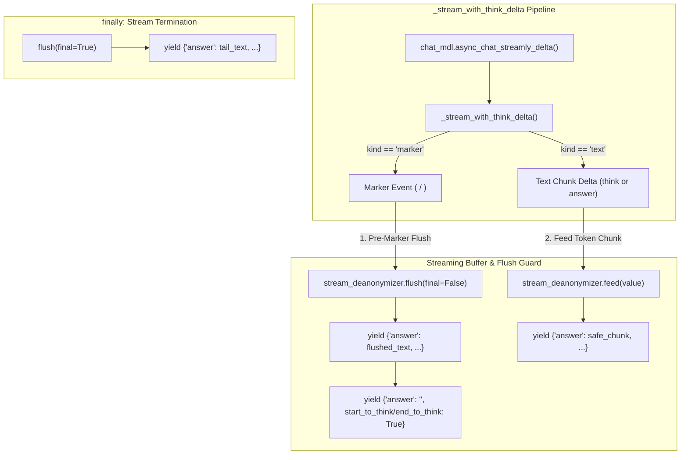
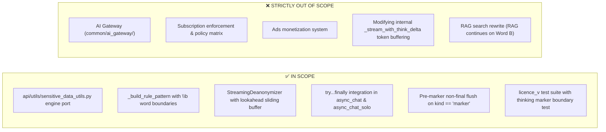

# Feature Specification: Sensitive Data Replacement Port to `licence_v`

**Feature Key:** `spec_sensitive_data_replacement_licence_v`  
**Target Modules:** `api/utils/sensitive_data_utils.py`, `api/db/services/dialog_service.py`, `test/test_sensitive_data_replacement.py`  
**Target Branch:** `licence_v`  
**Document Status:** Ready for Review  
**Version:** 1.0.0  
**Specification Owner:** AI Architecture Team / Antigravity Assistant  
**Date:** 2026-08-27  

---

## 1. Executive Summary & Problem Statement

### 1.1 Context & Background
The `licence_v` branch forms the foundation for the enterprise licensing edition of Swipies AI. The frontend configuration UI ([`sensitive-data-form-field.tsx`](file:///D:/ragflow/swipies_25/ragflow/web/src/pages/next-chats/chat/app-settings/sensitive-data-form-field.tsx)) and basic prompt configuration extraction are already present.

However, the backend implementation in `licence_v` still suffers from the two core privacy defects:
1. **Substring Word Corruption (No Word Boundaries):** Plaintext rules (e.g. `"cat"` $\to$ `"[ANIMAL]"`) corrupt arbitrary words (`"category"` $\to$ `"[ANIMAL]egory"`).
2. **Visual Placeholder Leakage during Streaming:** In both `async_chat` and `async_chat_solo`, `deanonymize_text(value, sensitive_rules)` is called statelessly per token delta. When LLM tokenization splits a placeholder across chunk boundaries (e.g. `["[CLI", "ENT_NAME]"]`), raw placeholder fragments leak into the client SSE feed.

### 1.2 Architecture Difference: `licence_v` vs `test`
Unlike the `test` branch:
- `licence_v` already correctly extracts `sensitive_config` in `async_chat_solo` (no `NameError`).
- Both `async_chat` and `async_chat_solo` share a unified modern streaming architecture based on `_stream_with_think_delta(stream_iter)` yielding structured dictionary objects `{"answer": value, "reference": {}, ...}` alongside special thinking markers (`("marker", "<think>")` / `("marker", "</think>")`).



---

## 2. Scope & Architectural Boundaries



---

## 3. User Stories & Acceptance Criteria

### 3.1 User Stories
- **US-1 (Natural Word Integrity):** *As a user configuring word replacement, I can replace terms like `"mail"` with `"[EMAIL]"` without corrupting words like `"blackmail"` or `"mailbox"`.*
- **US-2 (Leak-Free Reasoning & Response Streaming):** *As an enterprise user streaming an AI answer with reasoning (`<think>` blocks), placeholders are deanonymized seamlessly in both reasoning and final text without flashing technical placeholders.*
- **US-3 (Marker Boundary Isolation):** *As an AI user, when the model switches between thinking and final answer, partial buffered tokens are flushed immediately before the transition marker without cross-section bleeding.*
- **US-4 (Stream Abort Safety):** *As a user disconnecting or stopping generation mid-sentence, no buffered characters are silently dropped.*

---

### 3.2 Key Acceptance Criteria (Gated Checklist)

- [ ] **AC-1 (Utils Engine Enhancement in `api/utils/sensitive_data_utils.py`):**
  - Implement `_parse_bool(val) -> bool` for robust parsing of `case_sensitive` and `is_regex`.
  - Implement `_build_rule_pattern(term: str, is_regex: bool = False) -> str`:
    - Wraps `\b` automatically around alphanumeric/word boundaries (`\w`).
    - Leaves punctuation/symbol edges uncorrupted (`"$100"`, `"+1-800"`).
    - Returns raw pattern if `is_regex` is True.
  - Refactor `anonymize_text` and `deanonymize_text` to sort rules by descending length and use lambda replacements (`lambda _m, rv=replace_val: rv`) to prevent backslash escape corruption.
  - Implement `StreamingDeanonymizer` with lookahead sliding window bounded by `max_prefix_len = max(len(replace) - 1)` emitting non-matching prefix in $O(1)$.

- [ ] **AC-2 (Integration in `async_chat_solo` in `dialog_service.py`):**
  - For streaming mode: instantiate local `stream_deanonymizer = StreamingDeanonymizer(sensitive_rules) if sensitive_enabled else None`.
  - Wrap the `async for kind, value, state in _stream_with_think_delta(stream_iter):` loop in a `try...finally` block.
  - On `kind == "marker"`: if `stream_deanonymizer` has buffered text, flush it (`stream_deanonymizer.flush(final=False)`) and yield before yielding the marker flag dictionary.
  - On `kind == "text"`: feed `value` into `stream_deanonymizer.feed(value)` and yield safe chunk.
  - In `finally`: execute `stream_deanonymizer.flush(final=True)` and yield any remaining tail text.
  - For non-streaming mode: apply `deanonymize_text(answer, sensitive_rules)` to final answer.

- [ ] **AC-3 (Integration in `async_chat` in `dialog_service.py`):**
  - Identical `StreamingDeanonymizer` wrapping and marker flush in `async_chat` streaming loop with KB retrieval.
  - In `finally`: flush remaining buffer before decorating final answer.

- [ ] **AC-4 (Zero State Leakage & Zero Overhead when Disabled):**
  - A fresh `StreamingDeanonymizer` instance is created inside each function execution frame; no state persists across different requests.
  - When `sensitive_enabled = False`, `stream_deanonymizer` is `None`, adding zero function calls or latency overhead to streaming.

- [ ] **AC-5 (Preservation of Existing Think/Answer & Token Batching Logic):**
  - `_stream_with_think_delta()` remains completely untouched.
  - `num_tokens_from_string()` answer buffering inside `_stream_with_think_delta` continues to work normally.
  - Multi-turn conversation persistence (`conv.message`) preserves original Word A in DB.

- [ ] **AC-6 (Comprehensive Test Suite in `test/test_sensitive_data_replacement.py`):**
  - Unit tests: word boundary isolation (`"cat"` in `"category"`), punctuation symbols (`"$100"`), custom regex, case sensitivity, descending length rule priority.
  - Streaming tests: multi-chunk split (`["[CL", "IENT_", "NAME]"]`), uncompleted prefix forced flush on stream stop, zero-delay latency benchmark (100 chunks).
  - **NEW `licence_v` Scenario:** Chunk split on the exact boundary preceding a marker event (`("marker", "</think>")`) verifying that pre-marker flush clears the buffer without leaking into the subsequent answer section.
  - Solo & KB integration parity tests adapted for `licence_v` dictionary yield format.

---

## 4. Technical Design & Flow Architecture

### 4.1 Marker-Boundary Flush Logic in `dialog_service.py`

```python
stream_deanonymizer = StreamingDeanonymizer(sensitive_rules) if (sensitive_enabled and sensitive_rules) else None

try:
    async for kind, value, state in _stream_with_think_delta(stream_iter):
        last_state = state
        if kind == "marker":
            # 1. Flush any pending buffered text before the section marker transition
            if stream_deanonymizer:
                flushed = stream_deanonymizer.flush(final=False)
                if flushed:
                    yield {
                        "answer": flushed,
                        "reference": {},
                        "audio_binary": tts(tts_mdl, flushed) if tts_mdl else None,
                        "prompt": "",
                        "created_at": time.time(),
                        "final": False
                    }
            flags = {"start_to_think": True} if value == "<think>" else {"end_to_think": True}
            yield {
                "answer": "",
                "reference": {},
                "audio_binary": None,
                "prompt": "",
                "created_at": time.time(),
                "final": False,
                **flags
            }
            continue

        # 2. Text deltas are processed through the streaming lookahead buffer
        if stream_deanonymizer and value:
            value = stream_deanonymizer.feed(value)

        if value:
            yield {
                "answer": value,
                "reference": {},
                "audio_binary": tts(tts_mdl, value) if tts_mdl else None,
                "prompt": "",
                "created_at": time.time(),
                "final": False
            }
finally:
    # 3. Guaranteed drain on completion or stream interruption
    if stream_deanonymizer:
        tail = stream_deanonymizer.flush(final=True)
        if tail:
            yield {
                "answer": tail,
                "reference": {},
                "audio_binary": tts(tts_mdl, tail) if tts_mdl else None,
                "prompt": "",
                "created_at": time.time(),
                "final": False
            }
```

---

## 5. Verification & Test Plan

1. **Automated Unit & Streaming Tests:**
   ```powershell
   python test/test_sensitive_data_replacement.py
   ```
   Must pass all 11+ test cases (100% success).

2. **Regression Check:**
   Run existing test suite in `licence_v` to guarantee zero side-effects.

3. **Frontend Build Verification:**
   ```powershell
   cd web ; npm run build
   ```
