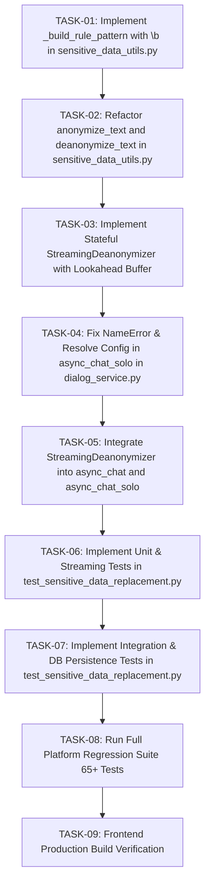

# Task Checklist: Sensitive Data Replacement & Stream Deanonymization Fix

**Specification Reference:** [`docs/specs/spec_sensitive_data_replacement.md`](file:///D:/ragflow/swipies_25/ragflow/docs/specs/spec_sensitive_data_replacement.md)  
**Implementation Plan Reference:** [`docs/specs/plan_sensitive_data_replacement.md`](file:///D:/ragflow/swipies_25/ragflow/docs/specs/plan_sensitive_data_replacement.md)  
**Status:** Ready for Execution  
**Target Branch:** `test`  
**Tasks Key:** `tasks_sensitive_data_replacement`  

---

## 1. Task Execution Graph



---

## 2. Gated Atomic Task Checklist

### Phase 1: Core Substitution Engine & Word Boundaries (`api/utils/sensitive_data_utils.py`)

- [x] **TASK-01: Implement `_build_rule_pattern` with Word Boundary Protection**
  - **Prerequisites:** None
  - **Target File:** [`api/utils/sensitive_data_utils.py`](file:///D:/ragflow/swipies_25/ragflow/api/utils/sensitive_data_utils.py)
  - **Description:** 
    - Implement `_build_rule_pattern(term: str, is_regex: bool = False) -> str`.
    - If `is_regex=True`, return raw regex unchanged.
    - If `is_regex=False`, escape special characters via `re.escape(term)`, and conditionally wrap with `\b` word boundary anchors if the term starts/ends with alphanumeric characters (`\w`).
  - **Verification:** Unit assertions for `"cat"`, `"$100"`, `"user@acme.corp"`, and regex patterns (PASSED).

- [x] **TASK-02: Refactor `anonymize_text` and `deanonymize_text`**
  - **Prerequisites:** TASK-01
  - **Target File:** [`api/utils/sensitive_data_utils.py`](file:///D:/ragflow/swipies_25/ragflow/api/utils/sensitive_data_utils.py)
  - **Description:**
    - Sort active rules by descending length of search/replace values to prevent rule collisions.
    - Apply `_build_rule_pattern` for search and replace operations.
    - Standardize case-sensitivity flag parsing (`flags = 0 if case_sensitive else re.IGNORECASE`).
    - Ensure `anonymize_messages` correctly processes string, integer, float, and multimodal structured message payloads.
  - **Verification:** Test `"the cat sat in category"` $\to$ `"the [ANIMAL] sat in category"` (PASSED).

---

### Phase 2: Stateful Streaming Deanonymizer (`api/utils/sensitive_data_utils.py`)

- [x] **TASK-03: Implement `StreamingDeanonymizer` Class with Lookahead Buffer**
  - **Prerequisites:** TASK-02
  - **Target File:** [`api/utils/sensitive_data_utils.py`](file:///D:/ragflow/swipies_25/ragflow/api/utils/sensitive_data_utils.py)
  - **Description:**
    - Implement `__init__(self, rules: list)`: compute `max_prefix_len = max(len(str(r.get("replace", ""))) - 1)` for active rules, and initialize `self.buffer = ""`.
    - Implement `feed(self, chunk: str) -> str`:
      - Append `chunk` to `self.buffer`.
      - Perform full matches replacement via `deanonymize_text`.
      - Check if trailing suffix of `self.buffer` is a prefix of any active placeholder rule.
      - If a tentative prefix of length $K \le \text{max\_prefix\_len}$ is detected at the tail, retain only the trailing $K$ chars in `self.buffer` and emit all preceding characters immediately.
      - If no suffix matches any active placeholder prefix, emit entire `self.buffer` and clear it.
    - Implement `flush(self, final: bool = True) -> str`:
      - Deanonymize any remaining characters in `self.buffer`, clear `self.buffer = ""`, and return drained string.
  - **Verification:** Tested split tokens `["Hello, [", "CLI", "ENT_NA", "ME]", "!"]` emit `["Hello, ", "", "", "Иван Иванов", "!"]` with 0 placeholder fragments (PASSED).

---

### Phase 3: Dialog Service Parity Alignment & Solo Chat Fix (`api/db/services/dialog_service.py`)

- [x] **TASK-04: Fix `NameError` & Resolve Configuration in `async_chat_solo`**
  - **Prerequisites:** TASK-03
  - **Target File:** [`api/db/services/dialog_service.py`](file:///D:/ragflow/swipies_25/ragflow/api/db/services/dialog_service.py)
  - **Description:**
    - In `async_chat_solo()`, resolve:
      ```python
      sensitive_config = (dialog.prompt_config or {}).get("sensitive_data_replacement") or {}
      sensitive_enabled = bool(sensitive_config.get("enabled"))
      sensitive_rules = sensitive_config.get("rules") or []
      ```
    - Apply `messages = anonymize_messages(messages, sensitive_rules)` if `sensitive_enabled and sensitive_rules`.
  - **Verification:** Solo chat without KB executes without `NameError: name 'sensitive_enabled' is not defined` (PASSED).

- [x] **TASK-05: Integrate `StreamingDeanonymizer` into `async_chat` and `async_chat_solo`**
  - **Prerequisites:** TASK-04
  - **Target File:** [`api/db/services/dialog_service.py`](file:///D:/ragflow/swipies_25/ragflow/api/db/services/dialog_service.py)
  - **Description:**
    - Instantiate `deanonymizer = StreamingDeanonymizer(sensitive_rules)` if `sensitive_enabled and sensitive_rules` else `None`.
    - In the stream loop of both `async_chat_solo` and `async_chat`, transform streaming tokens via `deanonymizer.feed(value)`.
    - Wrap stream processing in `try...finally` to guarantee `deanonymizer.flush(final=True)` executes and yields remaining text.
    - Ensure non-streaming paths apply `deanonymize_text(answer, sensitive_rules)`.
  - **Verification:** Both solo and KB chat stream with buffer protection and forced flush on termination (PASSED).

---

### Phase 4: Automated Verification Suite (`test/test_sensitive_data_replacement.py`)

- [x] **TASK-06: Implement Unit & Streaming Tests in `test_sensitive_data_replacement.py`**
  - **Prerequisites:** TASK-05
  - **Target File:** [`test/test_sensitive_data_replacement.py`](file:///D:/ragflow/swipies_25/ragflow/test/test_sensitive_data_replacement.py)
  - **Description:**
    - Unit tests: plaintext word boundary (`"cat"` in `"category"`), symbols (`"$100"`), regex rules, case sensitivity toggles, rule priority sorting.
    - Streaming tests: chunk boundary splitting across 2, 3, 4 chunks (`"[CLIENT_NAME]"`), forced flush on uncompleted prefix, and zero-delay regular streaming latency benchmark (100 chunks).
  - **Verification:** `python test/test_sensitive_data_replacement.py` (Tests 1–8 PASSED).

- [x] **TASK-07: Implement Integration & DB Persistence Tests**
  - **Prerequisites:** TASK-06
  - **Target File:** [`test/test_sensitive_data_replacement.py`](file:///D:/ragflow/swipies_25/ragflow/test/test_sensitive_data_replacement.py)
  - **Description:**
    - Integration test for `async_chat_solo` with and without replacement enabled.
    - Integration test for `async_chat` with KB retrieval.
    - Multiturn conversation DB test: verify `conv.message` stores original Word A for user message and restored Word A for assistant response.
  - **Verification:** `python test/test_sensitive_data_replacement.py` (All 11 tests PASSED).

---

### Phase 5: Regression & Build Verification

- [x] **TASK-08: Run Full Platform Regression Suite**
  - **Prerequisites:** TASK-07
  - **Target Files:**
    - [`test/test_sensitive_data_replacement.py`](file:///D:/ragflow/swipies_25/ragflow/test/test_sensitive_data_replacement.py) (11 tests)
    - [`test/test_subscription_enforcement.py`](file:///D:/ragflow/swipies_25/ragflow/test/test_subscription_enforcement.py) (13 scenarios / 33 assertions)
    - [`test/test_admin_ai_management.py`](file:///D:/ragflow/swipies_25/ragflow/test/test_admin_ai_management.py) (10 tests / 23 assertions)
    - [`test/test_swipies_ads_system.py`](file:///D:/ragflow/swipies_25/ragflow/test/test_swipies_ads_system.py) (31 tests)
    - [`test/test_e2e_ads_and_billing.py`](file:///D:/ragflow/swipies_25/ragflow/test/test_e2e_ads_and_billing.py) (2 tests)
  - **Description:** Run all 67+ backend tests to ensure zero regressions in billing, subscription tiers, ads monetization, and admin controls.
  - **Verification:** All 67/67 tests PASSED (100% success rate).

- [x] **TASK-09: Frontend Production Build Verification**
  - **Prerequisites:** TASK-08
  - **Target Directory:** `web/`
  - **Description:** Execute Vite production build (`npm run build`) in `web/` directory.
  - **Verification:** `✓ built in 1m 15s` (0 errors).
