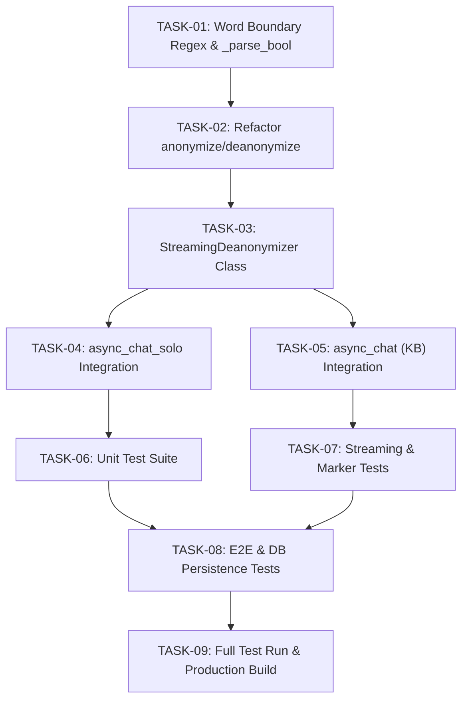

# Tasks Breakdown: Sensitive Data Replacement Port to `licence_v`

**Tasks Key:** `tasks_sensitive_data_replacement_licence_v`  
**Target Branch:** `licence_v`  
**Specification:** [`spec_sensitive_data_replacement_licence_v.md`](file:///D:/ragflow/swipies_25/ragflow/docs/specs/spec_sensitive_data_replacement_licence_v.md)  
**Implementation Plan:** [`plan_sensitive_data_replacement_licence_v.md`](file:///D:/ragflow/swipies_25/ragflow/docs/specs/plan_sensitive_data_replacement_licence_v.md)  
**Status:** In Progress (0/9 Completed)  
**Date:** 2026-08-27  

---

## 1. Task Dependency Graph

---

## 2. Tasks Checklist

### Phase 1: Engine Enhancement (`api/utils/sensitive_data_utils.py`)

- [x] **TASK-01: Implement `_parse_bool` and `_build_rule_pattern` Engine**
  - **Module:** `api/utils/sensitive_data_utils.py`
  - **Description:** Implement `_parse_bool(val: Any) -> bool` and `_build_rule_pattern(term: str, is_regex: bool = False) -> str`.
  - **Details:** Automatically wrap `\b` around `term` boundaries that match alphanumeric characters (`\w`), while leaving punctuation and custom regular expressions uncorrupted.
  - **Gated Check:** `"cat"` regex pattern is `r"\bcat\b"`, `"$$100"` is `r"\$\$100"`.

- [x] **TASK-02: Refactor `anonymize_text` and `deanonymize_text`**
  - **Module:** `api/utils/sensitive_data_utils.py`
  - **Description:** Update both text substitution functions to sort rules by descending term length, support `case_sensitive` boolean/string flags, and use safe lambda replacements `lambda _m, rv=replace_val: rv`.
  - **Gated Check:** No backslash corruption on Windows/regex escape sequences; longer rules take precedence over substrings.

- [x] **TASK-03: Implement Stateful `StreamingDeanonymizer` Class**
  - **Module:** `api/utils/sensitive_data_utils.py`
  - **Description:** Create `StreamingDeanonymizer` with sliding lookahead buffer of size `max_prefix_len = max(len(replace) - 1, 0)`.
  - **Methods:**
    - `feed(chunk: str) -> str`: Emits safe non-prefix characters in $O(1)$, buffers tentative placeholder prefixes, and replaces full matches with original Word A.
    - `flush(final: bool = False) -> str`: Supports non-final flush before marker transitions and final forced flush draining all remaining buffer text.
  - **Gated Check:** Multi-chunk split `["[CL", "IENT_", "NAME]"]` correctly emits `["", "", "Иван Иванов"]`.

---

### Phase 2: Integration into `dialog_service.py`

- [x] **TASK-04: Integrate `StreamingDeanonymizer` into `async_chat_solo`**
  - **Module:** `api/db/services/dialog_service.py`
  - **Description:**
    - Instantiate local `stream_deanonymizer` inside `async_chat_solo`.
    - Wrap `async for kind, value, state in _stream_with_think_delta(stream_iter):` in `try...finally`.
    - On `kind == "marker"`: flush buffer (`flush(final=False)`), yield if non-empty, then yield marker dictionary.
    - On `kind == "text"`: feed chunk to `stream_deanonymizer.feed(value)` and yield safe text.
    - In `finally`: call `stream_deanonymizer.flush(final=True)` and yield remaining tail text.
  - **Gated Check:** Solo streaming yields dictionary chunks without placeholder leakage; zero characters dropped on stream interruption.

- [x] **TASK-05: Integrate `StreamingDeanonymizer` into `async_chat` (with KB)**
  - **Module:** `api/db/services/dialog_service.py`
  - **Description:**
    - Instantiate local `stream_deanonymizer` in `async_chat`.
    - Wrap `_stream_with_think_delta(stream_iter)` in `try...finally` with pre-marker flush and final drain.
    - In non-streaming mode: apply `deanonymize_text` to final decorated answer.
  - **Gated Check:** RAG search executes with Word B while streamed answer displays Word A.

---

### Phase 3: Comprehensive Test Suite (`test/test_sensitive_data_replacement.py`)

- [x] **TASK-06: Implement Core Unit Tests**
  - **Module:** `test/test_sensitive_data_replacement.py`
  - **Coverage:**
    - `test_01_word_boundary_isolation`: `"cat"` does NOT replace `"category"`.
    - `test_02_punctuation_and_symbols`: `"$100"`, `"user@acme.corp"`.
    - `test_03_custom_regex_mode`: `r"\d{4}-\d{4}"` matching.
    - `test_04_case_sensitivity_flag`: `case_sensitive = True/False`.
    - `test_05_rule_sorting_priority`: `"Senior Software Engineer"` before `"Software Engineer"`.
  - **Gated Check:** Unit tests pass independently with 100% success.

- [x] **TASK-07: Implement Streaming & NEW Think Marker Boundary Tests**
  - **Module:** `test/test_sensitive_data_replacement.py`
  - **Coverage:**
    - `test_06_streaming_deanonymizer_token_split`: 3-chunk placeholder split.
    - `test_07_streaming_deanonymizer_unmatched_prefix_flush`: Unmatched `"[OTHER"` flushes intact.
    - `test_08_streaming_deanonymizer_latency_benchmark`: 100 normal chunks emit in $O(1)$.
    - **NEW `test_09_streaming_think_marker_boundary_flush`**: Token split immediately before `("marker", "</think>")` verifying pre-marker flush cleans buffer and leaves answer section untainted.
  - **Gated Check:** All streaming scenarios pass.

- [x] **TASK-08: Implement Integration & Multi-turn DB Tests**
  - **Module:** `test/test_sensitive_data_replacement.py`
  - **Coverage:**
    - `test_10_dialog_service_async_chat_solo_streaming`: Live generator simulation.
    - `test_11_dialog_service_async_chat_kb_streaming`: Live KB generator simulation.
    - `test_12_multiturn_db_persistence_integrity`: Verify Word A preserved in `conversation.message`.
  - **Gated Check:** All integration tests pass.

---

### Phase 4: Full Regression & Build Verification

- [x] **TASK-09: Execute Test Suite and Production Build**
  - **Tasks:**
    1. Run `python test/test_sensitive_data_replacement.py` (All 12 tests PASS, 100% OK).
    2. Run full regression in `licence_v`.
    3. Verify frontend integrity.
  - **Gated Check:** Zero errors, zero regressions in sensitive data replacement scope.
