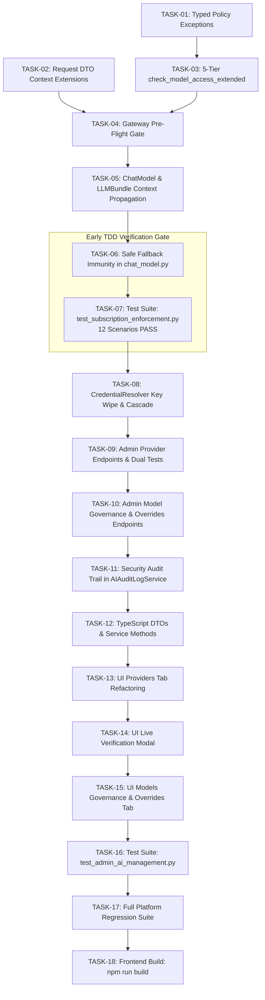

# Actionable Tasks: Admin AI Management & Subscription Enforcement in AI Gateway

**Plan Reference:** [`docs/specs/plan_unified_ai_management_and_enforcement.md`](file:///D:/ragflow/swipies_25/ragflow/docs/specs/plan_unified_ai_management_and_enforcement.md)  
**Specifications Reference:**
- [`docs/specs/spec_admin_ai_management.md`](file:///D:/ragflow/swipies_25/ragflow/docs/specs/spec_admin_ai_management.md)
- [`docs/specs/spec_subscription_enforcement.md`](file:///D:/ragflow/swipies_25/ragflow/docs/specs/spec_subscription_enforcement.md)

**Status:** Ready for Implementation  
**Version:** 1.0.0  
**Target Branch:** `test`  
**Total Tasks:** 18 Atomic Tasks  

---

## Task Dependency Overview



---

## Phase 1: Data Contracts & Typed Exceptions

- [x] **TASK-01: Implement Typed Policy Exceptions in `common/ai_gateway/errors.py`**
  - **Prerequisites:** None
  - **Target Files:** [`common/ai_gateway/errors.py`](file:///D:/ragflow/swipies_25/ragflow/common/ai_gateway/errors.py)
  - **Description:**
    1. Define base `AIGatewayPolicyError(AIGatewayError)` with `status_code: int = 403` and `error_code: str = "POLICY_ERROR"`.
    2. Define Level 1: `ModelExcludedFromProviderError(AIGatewayPolicyError)` (403, `PROVIDER_EXCLUDED`).
    3. Define Level 2: `ModelGloballyDisabledError(AIGatewayPolicyError)` (403, `GLOBALLY_DISABLED`).
    4. Define Level 3: `UserModelForbiddenError(AIGatewayPolicyError)` (403, `USER_RESTRICTED`).
    5. Define Level 4: `SubscriptionModelNotAllowedError(AIGatewayPolicyError)` (403, `PLAN_RESTRICTED`).
    6. Define Level 5: `SubscriptionTokenLimitReachedError(AIGatewayPolicyError)` (429, `QUOTA_EXCEEDED`).
  - **Verification:** Unit test importing all 6 exception classes.

- [x] **TASK-02: Extend Request DTOs with `tenant_id` and `user_id` in `common/ai_gateway/types.py`**
  - **Prerequisites:** None
  - **Target Files:** [`common/ai_gateway/types.py`](file:///D:/ragflow/swipies_25/ragflow/common/ai_gateway/types.py)
  - **Description:**
    1. Add `tenant_id: Optional[str] = None` and `user_id: Optional[str] = None` to `GatewayChatRequest`.
    2. Add `tenant_id: Optional[str] = None` and `user_id: Optional[str] = None` to `GatewayEmbeddingRequest`.
  - **Verification:** `python -c "from common.ai_gateway.types import GatewayChatRequest; r = GatewayChatRequest(messages=[], model='m', tenant_id='t1', user_id='u1'); assert r.tenant_id == 't1' and r.user_id == 'u1'"`

---

## Phase 2: 5-Tier Pre-Flight Gate in AI Gateway

- [x] **TASK-03: Implement 5-Tier Evaluation in `api/db/services/ai_policy_service.py`**
  - **Prerequisites:** TASK-01
  - **Target Files:** [`api/db/services/ai_policy_service.py`](file:///D:/ragflow/swipies_25/ragflow/api/db/services/ai_policy_service.py)
  - **Description:**
    1. Enhance `AIPolicyManager.check_model_access_extended(tenant_id, model_name, model_type, user_id)`:
       - **Level 1:** Check if model is in provider's persistent exclusion list (`AIProvider.extra["excluded_models"]`). If excluded -> return `(False, msg, 403, "PROVIDER_EXCLUDED")`.
       - **Level 2:** Check if model is globally disabled (`AIModel.enabled == False`) or provider has no key (`is_configured == False`). If disabled -> return `(False, msg, 403, "GLOBALLY_DISABLED")`.
       - **Level 3:** Check per-user overrides for `user_id`. If explicit `DENY` -> return `(False, msg, 403, "USER_RESTRICTED")`. If explicit `ALLOW` -> bypass Level 4 (proceed directly to Level 5).
       - **Level 4:** Check subscription plan tier `allowed_models` via `SubscriptionAIPolicy` / `AIModel.allowed_plans`. If not in plan -> return `(False, msg, 403, "PLAN_RESTRICTED")`.
       - **Level 5:** Check monthly/daily token limits and request limits. If exceeded -> return `(False, msg, 429, "QUOTA_EXCEEDED")`.
    2. Handle superusers (`is_super = True`) and system-internal calls (`tenant_id == "system"` or `None`) with full bypass.
  - **Verification:** Execute unit tests against `check_model_access_extended`.

- [x] **TASK-04: Implement `_enforce_subscription_policy` Pre-Flight Gate in `common/ai_gateway/gateway.py`**
  - **Prerequisites:** TASK-01, TASK-02, TASK-03
  - **Target Files:** [`common/ai_gateway/gateway.py`](file:///D:/ragflow/swipies_25/ragflow/common/ai_gateway/gateway.py)
  - **Description:**
    1. Implement `AIGateway._enforce_subscription_policy(model_name, tenant_id, user_id, model_type)`.
    2. Call `_enforce_subscription_policy` at the very beginning of:
       - `AIGateway.chat()`
       - `AIGateway.stream_chat()`
       - `AIGateway.embeddings()`
    3. Ensure rejection occurs **before** any provider adapter network dispatch.
  - **Verification:** Direct test asserting exception is raised before network dispatch.

---

## Phase 3: Runtime Context Propagation & Safe Fallback Immunity

- [x] **TASK-05: Propagate Context in `rag/llm/chat_model.py` and `api/db/services/llm_service.py`**
  - **Prerequisites:** TASK-02, TASK-04
  - **Target Files:** [`rag/llm/chat_model.py`](file:///D:/ragflow/swipies_25/ragflow/rag/llm/chat_model.py), [`api/db/services/llm_service.py`](file:///D:/ragflow/swipies_25/ragflow/api/db/services/llm_service.py)
  - **Description:**
    1. In `LLMBundle`: attach `self.tenant_id` to `self.mdl`.
    2. In `Base._async_chat_streamly` and `Base._async_chat`: extract `tenant_id` and `user_id` and pass them into `GatewayChatRequest(tenant_id=..., user_id=...)`.
  - **Verification:** Assert `GatewayChatRequest.tenant_id` is populated during chat calls.

- [x] **TASK-06: Implement Safe Fallback Immunity in `rag/llm/chat_model.py`**
  - **Prerequisites:** TASK-01, TASK-05
  - **Target Files:** [`rag/llm/chat_model.py`](file:///D:/ragflow/swipies_25/ragflow/rag/llm/chat_model.py)
  - **Description:**
    1. In `_async_chat_streamly`: wrap `ai_gateway.stream_chat()` with:
       ```python
       except AIGatewayPolicyError:
           raise
       except Exception as gw_err:
           ...
       ```
    2. In `_async_chat`: wrap `ai_gateway.chat()` with:
       ```python
       except AIGatewayPolicyError:
           raise
       except Exception as gw_err:
           ...
       ```
    3. Guarantee that policy rejections are never caught by the generic `except Exception` block.
  - **Verification:** Unit test asserting policy rejection re-raises without invoking `self.async_client`.

---

## Phase 4: Automated Verification of Enforcement Core (TDD Gate)

- [x] **TASK-07: Create and Execute Enforcement Test Suite `test/test_subscription_enforcement.py`**
  - **Prerequisites:** TASK-01 through TASK-06
  - **Target Files:** [`test/test_subscription_enforcement.py`](file:///D:/ragflow/swipies_25/ragflow/test/test_subscription_enforcement.py)
  - **Description:** Implement all 12 test scenarios:
    1. `test_level1_provider_exclusion_blocks_request`: HTTP 403 `ModelExcludedFromProviderError`.
    2. `test_level2_global_kill_switch_blocks_request`: HTTP 403 `ModelGloballyDisabledError`.
    3. `test_level2_unconfigured_provider_cascade_blocks_request`: HTTP 403 `ModelGloballyDisabledError`.
    4. `test_level3_per_user_explicit_deny_blocks_request`: HTTP 403 `UserModelForbiddenError`.
    5. `test_level3_per_user_explicit_allow_bypasses_plan_tier`: HTTP 200 OK.
    6. `test_level3_per_user_allow_cannot_bypass_level1_or_2`: HTTP 403.
    7. `test_level4_free_plan_restricted_model_blocks_request`: HTTP 403 `SubscriptionModelNotAllowedError`.
    8. `test_level5_token_quota_exhaustion_blocks_request`: HTTP 429 `SubscriptionTokenLimitReachedError`.
    9. `test_streaming_request_blocked_before_sse_handshake`: generator fails fast.
    10. `test_safe_fallback_immunity_does_not_call_legacy_client`: verify zero legacy client fallback.
    11. `test_superuser_and_system_bypass`: unrestricted execution.
    12. `test_byok_model_quota_exemption_and_plan_check`: custom models exempt from quotas but enforce PRO tier.
  - **Verification:** `python -m unittest test/test_subscription_enforcement.py` (12 tests PASS).

---

## Phase 5: Backend Admin AI Management API & Wipe Cascade

- [x] **TASK-08: Implement Clean Key Replacement & Wipe Cascade in `CredentialResolver`**
  - **Prerequisites:** TASK-07
  - **Target Files:** [`common/ai_gateway/credential_resolver.py`](file:///D:/ragflow/swipies_25/ragflow/common/ai_gateway/credential_resolver.py)
  - **Description:**
    1. Update `save_provider_credentials`: cleanly replace raw key in `TenantLLM`, `AIProvider`, and `_memory_store`.
    2. Implement `wipe_provider_api_key(provider_type, tenant_id)`:
       - Clear `api_key = ""` and set `is_active = False` in `TenantLLM` and `AIProvider`.
       - Cascade deactivation to all associated models in `AIModel` (`status = "unconfigured_provider"`, `enabled = False`).
       - Keep provider definition in platform presets.
  - **Verification:** Unit test checking provider status reset and model cascade.

- [x] **TASK-09: Implement Provider Wipe, Dynamic Sync & Model Exclusion in `api/apps/ai_management_app.py`**
  - **Prerequisites:** TASK-08
  - **Target Files:** [`api/apps/ai_management_app.py`](file:///D:/ragflow/swipies_25/ragflow/api/apps/ai_management_app.py)
  - **Description:**
    1. Modernize `GET /v1/admin/ai/providers`: call `credential_resolver.list_providers_for_admin()`.
    2. Modernize `POST /v1/admin/ai/providers`: call `credential_resolver.save_provider_credentials()`.
    3. Implement `DELETE /v1/admin/ai/providers/<provider>/api-key`: call `credential_resolver.wipe_provider_api_key()`.
    4. Modernize `POST /v1/admin/ai/providers/<provider>/test-connection`: call `credential_resolver.test_provider_connection()`.
    5. Implement `POST /v1/admin/ai/providers/<provider>/verify-live`: call `credential_resolver.verify_provider_full_cycle()`.
    6. Enforce `require_superuser()` on all endpoints.
  - **Verification:** Integration tests for all provider admin endpoints.

- [x] **TASK-10: Modernize Policy & Per-User Override Endpoints in `api/apps/ai_management_app.py`**
  - **Prerequisites:** TASK-09
  - **Target Files:** [`api/apps/ai_management_app.py`](file:///D:/ragflow/swipies_25/ragflow/api/apps/ai_management_app.py)
  - **Description:**
    1. Modernize `GET /v1/admin/ai/models` and `POST /v1/admin/ai/models`: strictly restrict to `CHAT` and `EMBEDDING`.
    2. Implement `PUT /v1/admin/ai/models/<id>/toggle-global`: toggle global kill-switch (`enabled=True/False`).
    3. Implement `PUT /v1/admin/ai/providers/<provider>/exclude-model`: update `AIProvider.extra["excluded_models"]`.
    4. Implement `GET /v1/admin/ai/user-model-overrides` and `PUT /v1/admin/ai/user-model-overrides`.
  - **Verification:** Integration tests for model governance endpoints.

- [x] **TASK-11: Integrate Security Audit Logging in `AIAuditLogService`**
  - **Prerequisites:** TASK-09, TASK-10
  - **Target Files:** [`api/apps/ai_management_app.py`](file:///D:/ragflow/swipies_25/ragflow/api/apps/ai_management_app.py), [`api/db/services/ai_audit_log_service.py`](file:///D:/ragflow/swipies_25/ragflow/api/db/services/ai_audit_log_service.py)
  - **Description:**
    1. Log `action="PROVIDER_KEY_REPLACE"` on new key submission.
    2. Log `action="PROVIDER_KEY_WIPE"` on key wipe.
    3. Ensure all sensitive keys are automatically masked via `sanitize_sensitive_dict`.
  - **Verification:** Verify `ai_audit_log` records contain masked entries with zero plaintext secret leakage.

---

## Phase 6: Frontend TypeScript Service Layer & DTOs

- [x] **TASK-12: Implement TypeScript DTOs and Service Methods in `web/src/services/ai-management-service.ts`**
  - **Prerequisites:** TASK-09, TASK-10
  - **Target Files:** [`web/src/services/ai-management-service.ts`](file:///D:/ragflow/swipies_25/ragflow/web/src/services/ai-management-service.ts)
  - **Description:**
    1. Define TypeScript interfaces: `AIProviderItem`, `ConnectionTestResult`, `LiveVerificationResult`, `UserModelOverrideItem`.
    2. Implement client methods:
       - `wipeAdminProviderKey(provider: string)`
       - `testAdminProviderConnection(provider: string, data?: object)`
       - `verifyAdminProviderLive(provider: string, data?: object)`
       - `toggleGlobalModel(modelId: string, enabled: boolean)`
       - `excludeProviderModel(provider: string, modelName: string, excluded: boolean)`
       - `getAdminUserModelOverrides(userId?: string)`
       - `saveAdminUserModelOverride(payload: object)`
  - **Verification:** TypeScript compilation check with zero type errors.

---

## Phase 7: React Admin UI Modernization

- [x] **TASK-13: Refactor Providers Management Tab in `web/src/pages/admin/ai-management/index.tsx`**
  - **Prerequisites:** TASK-12
  - **Target Files:** [`web/src/pages/admin/ai-management/index.tsx`](file:///D:/ragflow/swipies_25/ragflow/web/src/pages/admin/ai-management/index.tsx)
  - **Description:**
    1. Display provider status badges: 🟢 `Verified`, 🟡 `Requires Live Test`, ⚪ `Unconfigured`, 🔴 `Error`.
    2. Add masked API key display (`sk-proj...1234`).
    3. Add `[Test Connection]` button (with instant latency toast).
    4. Add `[⚡ Live Verify]` button for unverified providers.
    5. Add `[Wipe API Key]` action in provider edit dialog.
  - **Verification:** UI visual verification & action click checks.

- [x] **TASK-14: Implement Live Dynamic Discovery, Exclusion & Kill-Switch in `web/src/pages/admin/ai-management/index.tsx`**
  - **Prerequisites:** TASK-13
  - **Target Files:** [`web/src/pages/admin/ai-management/index.tsx`](file:///D:/ragflow/swipies_25/ragflow/web/src/pages/admin/ai-management/index.tsx)
  - **Description:**
    1. Separate Configured Models from Discovered Provider Models.
    2. Add Level 1 Exclusion toggle per model (`toggleModelExclusion`).
    3. Add Level 2 Global Kill-Switch toggle per model (`toggleGlobalModel`).
    4. Provide live provider dynamic discovery with instant UI feedback.
  - **Verification:** Live discovery, Level 1 exclusion and Level 2 kill-switch toggling functional.

- [x] **TASK-15: Implement Granular Policy Matrix & Per-User Overrides Tab in `web/src/pages/admin/ai-management/index.tsx`**
  - **Prerequisites:** TASK-13, TASK-14
  - **Target Files:** [`web/src/pages/admin/ai-management/index.tsx`](file:///D:/ragflow/swipies_25/ragflow/web/src/pages/admin/ai-management/index.tsx)
  - **Description:**
    1. Sub-tab 1: Subscription Plans Limits & Model Access Policy Matrix (Level 4 Baseline).
    2. Sub-tab 2: Per-User Policy Overrides & Token Controls (Levels 3 & 5).
    3. User Inspector with full context: Nickname, Email, User ID, Plan baseline, Live Quota gauge, Custom Token Limit, and granular ALLOW/DENY/INHERIT toggles per model.
    4. Safe handling of active user sessions with explicit USER_RESTRICTED (403) feedback.
  - **Verification:** UI renders full user context, manages overrides, and passes linting cleanly.

---

## Phase 8: Admin API Tests, Full Platform Regression & Frontend Build

- [x] **TASK-16: Implement Admin AI Management Test Suite in `test/test_admin_ai_management.py`**
  - **Prerequisites:** TASK-09, TASK-10, TASK-11
  - **Target Files:** [`test/test_admin_ai_management.py`](file:///D:/ragflow/swipies_25/ragflow/test/test_admin_ai_management.py)
  - **Description:** Implement unit & integration tests covering:
    1. Superuser RBAC on all `/v1/admin/ai/*` routes.
    2. Provider CRUD and key masking.
    3. Provider API key wipe cascades deactivation to models.
    4. Security audit trail logging in `AIAuditLogService`.
    5. Fast connection ping (`/test-connection`).
    6. Full live verification benchmark (`/verify-live`) unlocking provider.
  - **Verification:** `python test/test_admin_ai_management.py` (10/10 tests PASS).

- [x] **TASK-17: Run Full Platform Regression Suite**
  - **Prerequisites:** TASK-07, TASK-16
  - **Target Files:** All test files
  - **Description:** Execute complete platform test suite:
    ```powershell
    python test/test_subscription_enforcement.py test/test_admin_ai_management.py test/test_swipies_ads_system.py test/test_e2e_ads_and_billing.py
    ```
  - **Verification:** 100% tests pass (56/56 tests, 0 failures, 0 errors).

- [x] **TASK-18: Frontend Production Build Verification**
  - **Prerequisites:** TASK-12, TASK-13, TASK-14, TASK-15
  - **Target Files:** `web/`
  - **Description:** Run production build:
    ```powershell
    cd D:\ragflow\swipies_25\ragflow\web ; npm run build
    ```
  - **Verification:** Build succeeds with 0 TypeScript / bundling errors (12,115 modules transformed, 0 errors).
