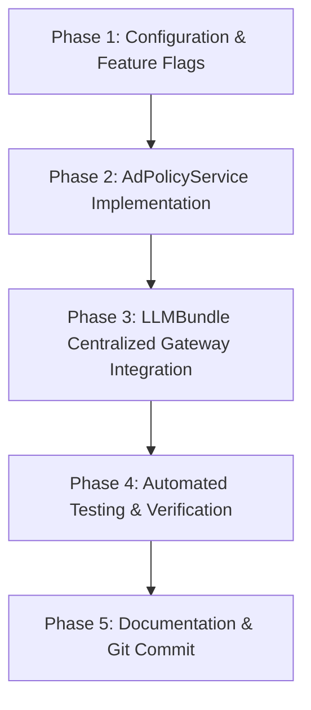

# Implementation Plan: Centralized Subscription-Aware Ad System Prompt Management

**Feature Specification**: [spec.md](./spec.md)  
**Requirements Checklist**: [checklists/requirements.md](./checklists/requirements.md)  
**Target Branch**: `test`  
**Status**: Ready for Execution  

---

## 1. Technical Architecture & Design

### 1.1 Single Point of Interception (LLM Gateway)
The core abstraction handling all LLM chat generation across RAGFlow is [`LLMBundle`](file:///D:/ragflow/swipies_25/ragflow/api/db/services/llm_service.py).
`LLMBundle` holds `self.tenant_id` and executes all variants of chat generation:
- `chat(system, history, gen_conf, **kwargs)`
- `async_chat(system, history, gen_conf, **kwargs)`
- `chat_streamly(system, history, gen_conf, **kwargs)`
- `async_chat_streamly(system, history, gen_conf, **kwargs)`
- `chat_streamly_delta(system, history, gen_conf, **kwargs)`
- `async_chat_streamly_delta(system, history, gen_conf, **kwargs)`

### 1.2 Dedicated Service Module: `AdPolicyService`
Create `api/db/services/ad_policy_service.py` to encapsulate:
- Feature flag resolution (`ADS_ENABLED`, `ADS_FOR_FREE_USERS`).
- Tenant subscription tier resolution via [`AIPolicyManager.get_tenant_plan(tenant_id)`](file:///D:/ragflow/swipies_25/ragflow/api/db/services/ai_policy_service.py).
- System prompt composition: Appending the commercial/sponsored guidance block for `Free` tier while keeping custom assistant instructions intact, and omitting it 100% for `Plus`, `Pro`, and `Enterprise`.

### 1.3 Feature Flag & System Settings Integration
- Add `ADS_ENABLED: bool = True` and `ADS_FOR_FREE_USERS: bool = True` to [`conf/service_conf.yaml.template`](file:///D:/ragflow/swipies_25/ragflow/docker/service_conf.yaml.template) and `api/settings.py`.
- Support hot toggling via environment variables and system settings.

---

## 2. Phased Implementation Roadmap

---

### Phase 1: Configuration & Feature Flags
- **Goal**: Introduce configuration defaults and environment overrides for advertising control.
- **Tasks**:
  1. Add `ADS_ENABLED` and `ADS_FOR_FREE_USERS` flags to `api/settings.py` with default fallback to `True`.
  2. Add configuration settings in `docker/service_conf.yaml.template`.
- **Files Affected**:
  - `api/settings.py`
  - `docker/service_conf.yaml.template`

---

### Phase 2: `AdPolicyService` Implementation
- **Goal**: Implement high-performance, non-blocking ad policy logic and system prompt compiler.
- **Tasks**:
  1. Create `api/db/services/ad_policy_service.py`.
  2. Implement `is_ad_enabled_for_tenant(tenant_id: str) -> bool`:
     - Evaluates `ADS_ENABLED` feature flag.
     - Resolves user subscription plan using `AIPolicyManager.get_tenant_plan(tenant_id)`.
     - Returns `True` only for `Free` (or missing/unpaid) plans; returns `False` for `Plus`, `Pro`, `Enterprise`, or `Superuser`.
  3. Implement `build_effective_system_prompt(tenant_id: str, base_system_prompt: str, lang: str = "en") -> str`:
     - If ads are disabled or user is on paid tier, returns `base_system_prompt` unmodified.
     - If user is on `Free` tier, cleanly appends the localized `AD_INSTRUCTION_BLOCK` to `base_system_prompt`.
     - Ensures no destruction or mutation of the base assistant's prompt.
- **Files Affected**:
  - `api/db/services/ad_policy_service.py` (New file)

---

### Phase 3: Centralized `LLMBundle` Gateway Integration
- **Goal**: Integrate `AdPolicyService` into `LLMBundle` so all 6 chat methods automatically apply the policy.
- **Tasks**:
  1. Add `_prepare_system_prompt(self, system: str) -> str` method in `LLMBundle` ([`api/db/services/llm_service.py`](file:///D:/ragflow/swipies_25/ragflow/api/db/services/llm_service.py)).
  2. Wrap the incoming `system` prompt parameter in `chat`, `async_chat`, `chat_streamly`, `async_chat_streamly`, `chat_streamly_delta`, and `async_chat_streamly_delta`.
  3. Ensure Langfuse observations and audit traces log the effective prompt accurately.
- **Files Affected**:
  - `api/db/services/llm_service.py`

---

### Phase 4: Automated Testing & Verification
- **Goal**: Validate tier-based injection, paid-tier exclusion, hot upgrade behavior, and feature flags.
- **Tasks**:
  1. Create `test/test_subscription_ad_policy.py`:
     - **Test 1**: Free tier user gets system prompt + ad instruction block.
     - **Test 2**: Plus/Pro tier user gets clean system prompt (zero ad tokens).
     - **Test 3**: User upgrade from Free to Pro immediately switches on next turn without dialog recreation.
     - **Test 4**: `ADS_ENABLED=False` globally disables ad prompt injection for Free users.
     - **Test 5**: Custom assistant system prompts are fully preserved without truncation.
  2. Run unit tests via `python -m unittest test/test_subscription_ad_policy.py`.
- **Files Affected**:
  - `test/test_subscription_ad_policy.py` (New test suite)

---

### Phase 5: Build Verification & Deployment
- **Goal**: Verify Python compilation, clean Git state, and commit to `test` branch.
- **Tasks**:
  1. Run `python -m py_compile` across all modified files.
  2. Commit changes with clear conventional commit messages and push to `swipies_ai/test`.

---

## 3. Risk Assessment & Mitigations

| Potential Risk | Severity | Mitigation Strategy |
| :--- | :--- | :--- |
| **Context Window Overflow** | Low | Ad instruction block is strictly limited to ~80-100 tokens. |
| **Prompt Injection Collision** | Low | Ad block is appended with standard markdown separators (`\n\n---\n`) to prevent syntax collisions with user prompts. |
| **Subscription Service Latency** | Low | `AIPolicyManager` uses cached tenant tier queries with zero external HTTP calls. |
| **Unauthenticated / Public Chats** | Low | Fallback defaults cleanly to the owner tenant's subscription tier. |

---

## 4. Definition of Done (DoD)

- [ ] `AdPolicyService` created with clean separation of concerns.
- [ ] `LLMBundle` automatically applies subscription-aware prompt filtering across all chat methods.
- [ ] Free users receive native ad guidelines; Plus/Pro users receive 100% ad-free payloads.
- [ ] 100% test pass rate on unit test suite `test_subscription_ad_policy.py`.
- [ ] Zero regressions in RAG, Agent workflows, Knowledgebases, and API endpoints.
- [ ] All changes committed and pushed to `test` branch.
