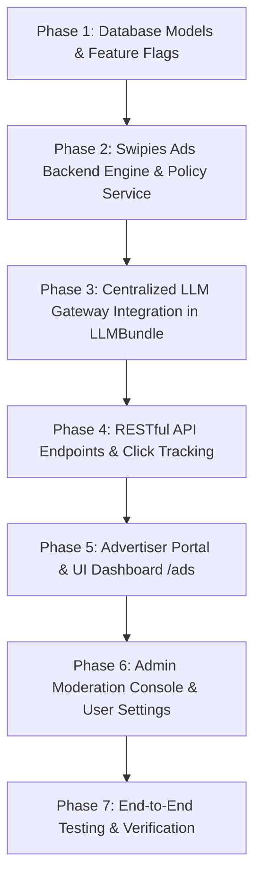

# Comprehensive Implementation Plan: Swipies Ads — Global AI Advertising & Monetization Platform

**Feature Specification**: [spec.md](./spec.md)  
**Requirements Checklist**: [checklists/requirements.md](./checklists/requirements.md)  
**Target Branch**: `test`  
**Status**: Ready for Phased Execution  

---

## 1. System Architecture Overview

```text
┌────────────────────────────────────────────────────────────────────────────────────────┐
│                                   SWIPIES ADS PLATFORM                                 │
├───────────────────────────────────────┬────────────────────────────────────────────────┤
│            BACKEND CORE               │                  FRONTEND UI                   │
├───────────────────────────────────────┼────────────────────────────────────────────────┤
│ 1. Database Entities & Models         │ 1. Advertiser Portal (/ads)                    │
│    - Advertiser, AdCampaign           │    - KPI Metrics Dashboard & Balance           │
│    - AdImpression, AdClick            │    - Campaign Manager & Create Wizard          │
│    - AdTransaction, AdSettings        │    - Deep Analytics & Performance Charts       │
│                                       │    - Billing & Wallet Top-up                   │
│ 2. Swipies Ads Engine                 │                                                │
│    - Semantic & Intent Matcher        │ 2. Admin Ads Console (/admin/ads)              │
│    - Frequency Capping Evaluator      │    - Campaign Moderation Queue (Approve/Reject)│
│    - Budget & Balance Verifier        │    - Network Revenue & Spend Overview          │
│    - Winner Auction Ranker            │                                                │
│                                       │ 3. User Settings & Plan Badges                 │
│ 3. Centralized LLM Gateway            │    - Navigation Link: Settings -> Swipies Ads  │
│    - LLMBundle Single Point of Truth  │    - Plan Badges (Sponsored vs 100% Ad-Free)   │
│    - Subscription Tier Filter         │                                                │
│    - 14 Rules System Prompt Injection │ 4. Chat UI Sponsored Formatting                │
│                                       │    - Native [Sponsored] Card & Click Tracking  │
│ 4. RESTful API & Tracking Endpoints   │                                                │
│    - /v1/ads/*, /v1/admin/ads/*       │                                                │
└───────────────────────────────────────┴────────────────────────────────────────────────┘
```

---

## 2. Phased Implementation Roadmap



---

### Phase 1: Database Entities & Configuration Flags
- **Goal**: Establish the persistence layer and feature flag infrastructure.
- **Tasks**:
  1. Add database models in [`api/db/db_models.py`](file:///D:/ragflow/swipies_25/ragflow/api/db/db_models.py):
     - `Advertiser`: Account balance, company name, status (`active`, `suspended`), user/tenant relation.
     - `AdCampaign`: Product details, ad copy, landing URL, keywords, target categories, budgets, bid amount, pricing model (`cpc`/`cpm`), status (`draft`, `active`, `paused`, `completed`), moderation status (`pending`, `approved`, `rejected`).
     - `AdImpression`: Tracking records with tenant_id, conversation_id, cost, timestamp.
     - `AdClick`: Unique click tracking, impression linkage, cost, IP hash.
     - `AdTransaction`: Financial deposits, spend debits, refund logs.
     - `AdSettings`: Configurable network parameters (frequency caps, min bids).
  2. Add automatic table creation on startup in `api/db/services/ad_engine_service.py` / `api/db/init_data.py`.
  3. Add feature flags in `api/settings.py` and `docker/service_conf.yaml.template`:
     - `ADS_ENABLED: bool = True`
     - `ADS_FOR_FREE_USERS: bool = True`
     - `ADS_LLM_PROMPT_ENABLED: bool = True`
     - `ADS_TARGETING_ENABLED: bool = True`
     - `ADS_BILLING_ENABLED: bool = True`
     - `ADS_ANALYTICS_ENABLED: bool = True`
- **Deliverables**:
  - `api/db/db_models.py`
  - `api/settings.py`
  - `docker/service_conf.yaml.template`

---

### Phase 2: Swipies Ads Engine & Targeting Service
- **Goal**: Implement intent analysis, semantic & keyword campaign matching, frequency capping, and budget verification.
- **Tasks**:
  1. Create `api/db/services/ad_engine_service.py`:
     - `match_campaign_for_query(tenant_id, user_id, user_query, conversation_id) -> dict | None`:
       - Query intent extraction & keyword search.
       - Filter active, approved campaigns with positive balance and remaining daily budget.
       - Frequency capping check (e.g. max 3 impressions per user per day per campaign).
       - Relevance and priority scoring.
       - Record impression and reserve budget.
     - `track_click(click_token, user_id, ip_address) -> str (landing_url)`:
       - Deduplicate clicks within 1 hour.
       - Record `AdClick` and deduct CPC cost from advertiser balance.
     - `get_advertiser_stats(advertiser_id) -> dict`:
       - Aggregates impressions, clicks, CTR, and spend breakdown.
  2. Create `api/db/services/ad_policy_service.py`:
     - `is_ad_eligible_user(tenant_id: str) -> bool`:
       - Evaluates `AIPolicyManager.get_tenant_plan(tenant_id)`.
       - Returns `True` strictly for `Free` tier; returns `False` for `Plus`, `Pro`, `Enterprise`, or `Superuser`.
     - `build_ad_system_prompt_block(campaign: dict | None, lang: str = "en") -> str`:
       - Generates structured instruction context containing the 14 rules and the selected campaign data.
     - `build_effective_system_prompt(tenant_id, base_system_prompt, user_query, conversation_id) -> str`:
       - Orchestrates the full prompt assembly hierarchy.
- **Deliverables**:
  - `api/db/services/ad_engine_service.py` (New file)
  - `api/db/services/ad_policy_service.py` (New file)

---

### Phase 3: Centralized LLM Gateway Integration (`LLMBundle`)
- **Goal**: Unify prompt injection inside the single LLM execution gateway.
- **Tasks**:
  1. In [`api/db/services/llm_service.py`](file:///D:/ragflow/swipies_25/ragflow/api/db/services/llm_service.py) (`LLMBundle`):
     - Add `_prepare_system_prompt(self, system: str, history: list) -> str`.
     - In all 6 chat methods (`chat`, `async_chat`, `chat_streamly`, `async_chat_streamly`, `chat_streamly_delta`, `async_chat_streamly_delta`):
       - Intercept `system` and `history` to evaluate the user's latest message.
       - If user is `Free`, resolve matched ad and append instructions.
       - If user is `Plus`/`Pro`, strictly retain the clean original `system` prompt.
  2. Ensure Langfuse traces, token usage counting, and stream deltas continue to operate seamlessly.
- **Deliverables**:
  - `api/db/services/llm_service.py`

---

### Phase 4: RESTful APIs & Tracking Endpoints
- **Goal**: Provide complete API contracts for the Advertiser Portal, Admin Console, and Redirect Click Tracking.
- **Tasks**:
  1. Create `api/apps/ad_app.py` and `api/apps/restful_apis/ad_api.py`:
     - `GET /v1/ads/dashboard`: Advertiser balance, metrics (impressions, clicks, CTR, spend), active campaigns.
     - `GET /v1/ads/campaigns`: List campaigns for current advertiser.
     - `POST /v1/ads/campaigns`: Create new campaign with budget and targeting.
     - `PUT /v1/ads/campaigns/<id>`: Update campaign details / budget.
     - `POST /v1/ads/campaigns/<id>/toggle_status`: Pause / Resume campaign.
     - `GET /v1/ads/campaigns/<id>/analytics`: Detailed timeseries telemetry.
     - `POST /v1/ads/billing/deposit`: Top up advertiser balance.
     - `GET /v1/ads/billing/transactions`: Financial ledger.
     - `GET /v1/ads/r/<click_token>`: Secure click tracking redirect endpoint.
     - `GET /v1/admin/ads/overview`: Network-wide overview for administrators.
     - `GET /v1/admin/ads/moderation`: Pending campaign moderation queue.
     - `POST /v1/admin/ads/moderation/<id>/approve`: Approve campaign.
     - `POST /v1/admin/ads/moderation/<id>/reject`: Reject campaign with feedback note.
  2. Register blueprint routes in `api/server.py`.
- **Deliverables**:
  - `api/apps/ad_app.py` (New file)
  - `api/apps/restful_apis/ad_api.py` (New file)
  - `api/server.py`

---

### Phase 5: Advertiser Portal & Web Dashboard (`/ads`)
- **Goal**: Deliver a world-class advertiser dashboard and campaign management UI.
- **Tasks**:
  1. Create `web/src/pages/ads/`:
     - `index.tsx`: Main Advertiser Dashboard with Balance card, KPI tiles, Trends chart, Quick Actions.
     - `campaigns.tsx`: Campaign Table with status indicators, spend progress, CTR, and action controls.
     - `campaign-modal.tsx`: Multi-step Campaign Creator Wizard (Targeting, Copy, Budget, Schedule).
     - `analytics.tsx`: Detailed campaign performance breakdown with timeseries charts.
     - `billing.tsx`: Wallet balance, deposit simulation modal, transaction history.
     - `onboarding.tsx`: Engaging intro page for users creating their first campaign.
  2. Create service layer `web/src/services/ad-service.ts`.
  3. Add route `/ads` to `web/src/routes.tsx`.
- **Deliverables**:
  - `web/src/pages/ads/index.tsx`
  - `web/src/pages/ads/campaigns.tsx`
  - `web/src/pages/ads/campaign-modal.tsx`
  - `web/src/pages/ads/analytics.tsx`
  - `web/src/pages/ads/billing.tsx`
  - `web/src/pages/ads/onboarding.tsx`
  - `web/src/services/ad-service.ts`
  - `web/src/routes.tsx`

---

### Phase 6: Admin Moderation Console & User Navigation
- **Goal**: Provide moderation tools in the Admin Panel and integrate Ads into User Settings.
- **Tasks**:
  1. Create `web/src/pages/admin/ads/index.tsx`:
     - Moderation review table with preview of ad text, landing URL, and 1-click Approve/Reject modals.
     - Network statistics (Total Revenue, Active Campaigns, Global Impressions).
  2. Add `Swipies Ads` navigation item in User Settings sidebar (`web/src/pages/user-setting/sidebar.tsx` or navigation menus).
  3. Update Subscription Plan cards in Pricing / Settings:
     - Free: `⚠ Sponsored AI recommendations`.
     - Plus/Pro: `✓ Guaranteed 100% Ad-Free`.
  4. Add native sponsored card formatting helper in `web/src/pages/chat/` for rendering `[Sponsored]` blocks with styling.
- **Deliverables**:
  - `web/src/pages/admin/ads/index.tsx`
  - `web/src/pages/user-setting/sidebar.tsx`
  - `web/src/locales/en.ts` & `web/src/locales/ru.ts`

---

### Phase 7: Automated Testing, Verification & Build
- **Goal**: Full automated test coverage and zero-downtime deployment verification.
- **Tasks**:
  1. Create comprehensive unit & integration test suite `test/test_swipies_ads_system.py`:
     - **Test 1**: Free tier prompt injection + valid campaign matching.
     - **Test 2**: Plus / Pro 100% ad-free payload guarantee.
     - **Test 3**: Frequency capping enforcement (max impressions per user).
     - **Test 4**: Campaign budget exhaustion and advertiser balance deductions.
     - **Test 5**: Click tracking and redirection attribution.
     - **Test 6**: Admin campaign approval / rejection workflow.
     - **Test 7**: Global feature flags (`ADS_ENABLED=False`) kill-switch test.
  2. Verify Python compilation (`python -m py_compile ...`).
  3. Verify Frontend build (`npm run build` in `web/`).
  4. Commit all changes to `test` branch and push to remote `swipies_ai/test`.
- **Deliverables**:
  - `test/test_swipies_ads_system.py`

---

## 3. Definition of Done (DoD)

- [ ] All database entities (`Advertiser`, `AdCampaign`, `AdImpression`, `AdClick`, `AdTransaction`, `AdSettings`) active and initialized.
- [ ] Swipies Ads Engine matching logic, frequency capping, and budget tracking fully functional.
- [ ] Centralized `LLMBundle` gateway enforces prompt injection for Free users and 100% ad-free experience for Plus/Pro.
- [ ] Advertiser Portal (`/ads`) and Admin Moderation Console (`/admin/ads`) accessible with complete UI.
- [ ] 100% passing test suite across all 7 automated test categories.
- [ ] Zero breaking changes in existing dialogues, datasets, agents, or RAG flows.
- [ ] All code committed and pushed to `test` branch.
