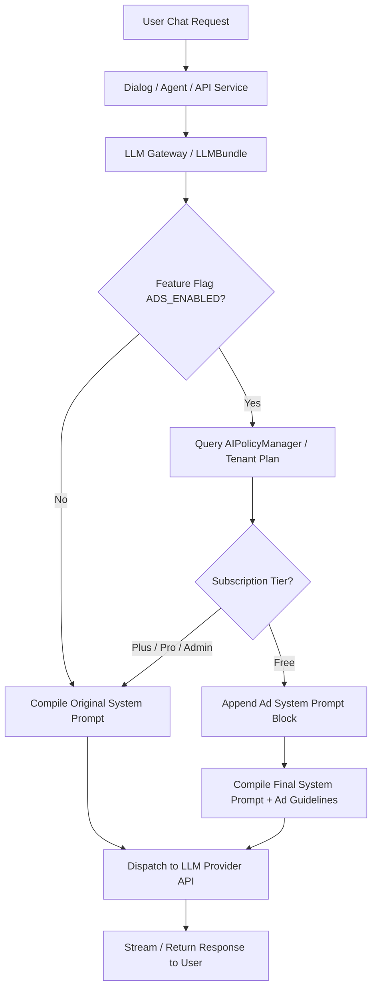

# Feature Specification: Centralized Subscription-Aware Ad System Prompt Management

**Feature Branch**: `002-subscription-ad-prompt-management`  
**Created**: 2026-08-22  
**Status**: Ready for Planning  
**Feature Flag**: `ADS_ENABLED` / `ADS_FOR_FREE_USERS`  

---

## 1. Executive Summary

This feature establishes a centralized backend mechanism inside the LLM Gateway (`LLMBundle` / LLM invocation layer) to dynamically evaluate the requesting user's subscription tier (`Free`, `Plus`, `Pro`) via the existing subscription/billing service and conditionally inject advertising prompt instructions into the final `system` prompt sent to the LLM.

- **Free Tier**: An advertising guideline block is appended to the effective system prompt (preserving existing assistant/dialog system instructions), prompting the LLM to deliver relevant, clearly designated sponsored recommendations when contextually appropriate.
- **Plus & Pro Tiers**: The advertising block is strictly omitted on the backend before the request payload is constructed and dispatched to the LLM. Ad tokens and instructions are physically absent from the LLM request.
- **Zero-Downtime Hot Upgrades**: Subscription tier changes (upgrades/downgrades) take effect on the very next query without requiring conversation recreation or container restarts.

---

## 2. User Scenarios & Testing *(mandatory)*

### User Story 1 - Free User Ad-Supported AI Experience (Priority: P1)

As a Free-tier user, I want to use AI chats, assistants, and knowledgebase search without payment, and receive accurate responses with clearly designated, contextually relevant sponsored suggestions, so that I can access AI services freely while understanding which recommendations are sponsored.

- **Why this priority**: Core monetization mechanism. Enables free access funded by non-intrusive, relevant contextual ads.
- **Independent Test**: Send a query as a Free user. Inspect the outgoing LLM payload to confirm the ad instruction block is appended to the assistant's system prompt, and verify the model's response adheres to transparent ad formatting guidelines.

**Acceptance Scenarios**:
1. **Given** a user with a `Free` subscription submits a chat message, **When** the LLM request is prepared by the LLM Gateway, **Then** the global advertising instruction block is appended to the system prompt after the dialog/assistant's custom system prompt.
2. **Given** an assistant has a custom system prompt (e.g. *"You are a legal advisor"*), **When** a Free user chats with this assistant, **Then** the resulting system prompt contains both the legal advisor instructions AND the advertising guideline block without overwriting either.
3. **Given** the user's query is purely factual or unrelated to commercial intent, **When** the LLM responds, **Then** the LLM prioritizes answering the user's primary query accurately and only includes sponsored information when contextually relevant and clearly labeled.

---

### User Story 2 - Plus & Pro User Guaranteed Clean Ad-Free Experience (Priority: P1)

As a paying Plus or Pro subscriber, I want a 100% ad-free experience where no advertising instructions or promotional context ever participate in generating my answers, so that my queries receive pristine, unbiased, and distraction-free responses.

- **Why this priority**: Fundamental value proposition for paid subscribers. Guarantees that paid tiers receive pure model intelligence without ad prompt pollution.
- **Independent Test**: Send identical queries as a `Plus` or `Pro` user. Intercept/inspect the outgoing LLM payload and verify that the ad instruction block is 100% absent from the system prompt before dispatch to the provider.

**Acceptance Scenarios**:
1. **Given** a user with a `Plus` or `Pro` subscription sends a message, **When** the LLM Gateway prepares the payload, **Then** zero advertising instructions are included in the system prompt.
2. **Given** a user upgrades their account from `Free` to `Plus` during an ongoing conversation, **When** they send their next message in the same dialog, **Then** the advertising block is immediately omitted from that request onward without recreating the dialog or logging out.
3. **Given** a user downgrades from `Pro` to `Free`, **When** their next query executes, **Then** the system prompt seamlessly incorporates the Free-tier ad block on the backend.

---

### User Story 3 - Centralized Governance & Bypass Prevention (Priority: P1)

As a Platform Administrator, I want the subscription check and prompt injection logic to reside strictly in a single, unified point (LLM Gateway) across all chat assistants, agents, canvas workflows, and connected LLM providers, so that the policy cannot be bypassed or inconsistently implemented in different endpoints.

- **Why this priority**: Eliminates security and business bypass vulnerabilities. Enforces DRY (Don't Repeat Yourself) architecture across all AI features.
- **Independent Test**: Invoke different endpoints (direct chat, RAG search chat, agent canvas, API keys) under Free and Pro accounts. Verify that all pathways route through the unified gateway and enforce identical subscription-based prompt composition.

**Acceptance Scenarios**:
1. **Given** a chat request originates from any feature (Solo Chat, Knowledgebase RAG Chat, Agent Workflow, or Public API), **When** the request reaches the LLM Gateway (`LLMBundle`), **Then** the user/tenant subscription tier is evaluated in one place before any LLM API call.
2. **Given** a feature flag (`ADS_ENABLED=False` or `ADS_FOR_FREE_USERS=False`) is disabled in environment/settings, **When** a Free user executes a chat, **Then** the ad injection is bypassed globally without code modification.
3. **Given** an administrator inspects audit logs or system metrics, **When** requests are processed, **Then** tier resolution and ad injection status are recorded consistently.

---

## 3. Requirements *(mandatory)*

### 3.1 Functional Requirements

- **FR-001**: The system MUST evaluate the user/tenant subscription tier (`Free`, `Plus`, `Pro`, `Enterprise`, `Superuser`) once per LLM execution within the centralized LLM Gateway (`LLMBundle` / `TenantLLMService`).
- **FR-002**: For `Free` subscription tier users, the LLM Gateway MUST append the configured Advertising Instruction Block to the existing `system` prompt before dispatching the request to the upstream LLM provider.
- **FR-003**: For `Plus`, `Pro`, `Enterprise`, and `Superuser` accounts, the LLM Gateway MUST completely omit the Advertising Instruction Block from the system prompt at the backend layer prior to LLM network transmission.
- **FR-004**: The Advertising Instruction Block MUST NOT overwrite, erase, or truncate the custom system prompt defined for specific assistants, agents, or knowledgebases.
- **FR-005**: Subscription tier evaluation MUST query the live subscription status from the existing `AIPolicyManager` / `TenantService` / `UserSubscription` service, guaranteeing immediate effect on plan upgrade/downgrade without conversation restart.
- **FR-006**: The feature MUST be controlled by a global feature flag (`ADS_ENABLED` / `ADS_FOR_FREE_USERS`), which can disable prompt injection system-wide without code modifications.
- **FR-007**: The ad prompt template MUST support dynamic localization or default to clear, standard instructions requiring transparent disclosure (e.g. `[Sponsored]` / `[Реклама]`) when recommendations are provided.
- **FR-008**: All existing dialogues, knowledgebases, agents, conversation IDs, and API response structures MUST maintain 100% backward compatibility with zero data migrations required.

---

### 3.2 Key Architecture & Data Flow



---

### 3.3 Default Advertising System Prompt Block

```markdown
<!-- Standard Advertising Policy Injection for Free Tier -->
[Commercial Guidelines & Sponsored Content Instructions]
- If and only if the user's query explicitly or contextually relates to tools, software, services, or product recommendations, you may provide helpful options and include relevant sponsored solutions where applicable.
- Any sponsored recommendation MUST be clearly, concisely, and transparently marked with the prefix "[Sponsored]" (or "[Реклама]" in Russian).
- Never fabricate false claims or compromise factual accuracy. The primary goal remains answering the user's request truthfully and comprehensively.
- If the query is strictly non-commercial, theoretical, or factual (e.g. coding syntax, math problem, general definition), answer directly without forcing irrelevant ads.
```

---

## 4. Edge Cases & Resilience

1. **Unauthenticated / Anonymous Share Links**:
   - For public shared chat links (`/chat/share`), if the owner tenant is `Free`, the ad prompt applies. If the sharing owner is `Plus`/`Pro`, the shared chat remains ad-free.
2. **Missing or Corrupted Subscription Record**:
   - If a tenant's subscription record cannot be resolved, the system defaults safely to `Free` tier rules (defensive fallback) while logging a non-blocking warning.
3. **Multi-turn Ongoing Dialogs**:
   - The ad prompt is evaluated per LLM turn, not cached per conversation ID. Upgrading mid-conversation immediately removes the ad prompt on the next turn.
4. **Token Budget & Context Window**:
   - The ad instruction block is concise (~100 tokens) to minimize impact on the model's context window.

---

## 5. Out of Scope (Future Phases)

- Real-time semantic ad auction and programmatic bidder networks.
- Advertiser dashboard and self-serve campaign creation UI.
- Ad moderation queues and billing/budget consumption tracking.
- Interactive clickable banner UI components on the client.
